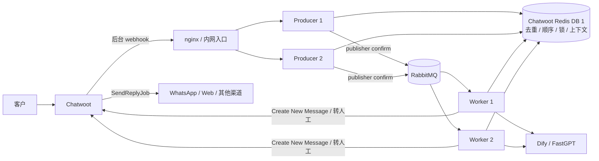
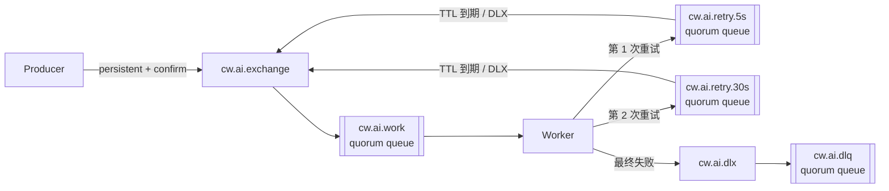
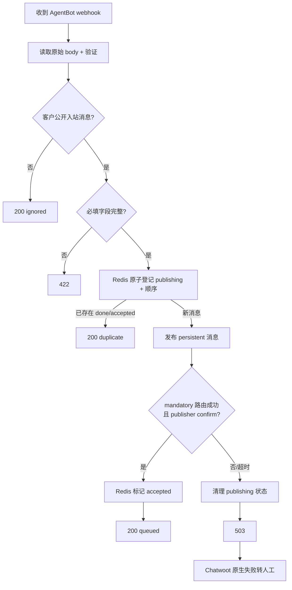
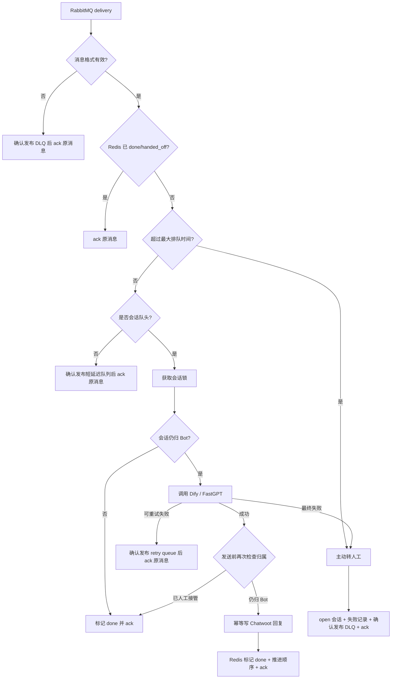

# Chatwoot AI 客服 Bridge 异步回写方案（Node + RabbitMQ）

> 配套文档：[ai-chatwoot-customer-service-integration.md](./ai-chatwoot-customer-service-integration.md)
>
> 本方案依据当前项目源码、Chatwoot 官方 AgentBot 工作方式和 RabbitMQ 官方可靠投递机制整理。已确认 Dify / FastGPT 一次响应通常需要约 2 分钟。

## 0. 先看结论

Chatwoot 原生支持异步 AgentBot：

```text
客户发消息
  ↓
Chatwoot 后台推送 webhook
  ↓
Bridge 把任务可靠发布到 RabbitMQ
  ↓
RabbitMQ 确认接收后，Bridge 快速返回 200
  ↓
Worker 后台调用 AI，等待约两分钟
  ↓
Worker 调用 Create New Message API
  ↓
Chatwoot 后台发送到 WhatsApp / 网页聊天等实际渠道
```

Bridge 不在 webhook 请求里等 AI，也不需要把 Chatwoot 全站 `WEBHOOK_TIMEOUT` 调到两分钟。

RabbitMQ 在这里负责保存“Chatwoot 已经交给 Bridge、但尚未处理完成”的任务；Chatwoot 现有 Redis 只保存 Bridge 的去重、会话顺序、分布式锁和 Provider 上下文，不再承担主任务队列。

生产可靠性的核心规则：

1. **RabbitMQ publisher confirm 成功后才能向 Chatwoot 返回 200。**
2. **消息必须持久化，exchange/queue 必须 durable。**
3. **Worker 使用手动 ack，业务完成前不能确认消息。**
4. **重试消息或 DLQ 消息确认发布成功后，才能 ack 原消息。**
5. **RabbitMQ 是 at-least-once，业务必须能处理重复消息。**

---

## 1. Chatwoot 哪些地方已经异步

### 1.1 客户消息不会等待 AgentBot

当前项目通过：

```ruby
AgentBots::WebhookJob.perform_later(agent_bot.outgoing_url, payload)
```

把 AgentBot webhook 交给后台任务。客户发消息的原始请求不会等待 Bridge。

源码：`app/listeners/agent_bot_listener.rb:67-70`。

### 1.2 webhook 后台任务只需要等 Bridge 快速确认

Chatwoot 后台任务内部执行普通 HTTP POST，默认超时 5 秒：

```ruby
RestClient::Request.execute(..., timeout: webhook_timeout)
```

它等待的是 Bridge 的“RabbitMQ 已可靠接收”，不是 AI 答案。

源码：

- `app/jobs/webhook_job.rb:4-5`
- `lib/webhooks/trigger.rb:33-41`
- `lib/webhooks/trigger.rb:108-113`

### 1.3 AI 答案通过独立 API 延后写回

Chatwoot 官方 AgentBot 流程是：Bot 收到 webhook 后自行处理，再通过 Create New Message API 回写。

- [Chatwoot AgentBot 官方说明](https://www.chatwoot.com/hc/user-guide/articles/1677497472-how-to-use-agent-bots)
- [Create New Message API](https://developers.chatwoot.com/api-reference/messages/create-new-message)

回复不放在 webhook HTTP 响应体中。

### 1.4 Chatwoot 向实际渠道发送也是后台任务

Create New Message API 先保存消息，随后 Chatwoot 执行：

```ruby
SendReplyJob.perform_later(id)
```

再把消息发到 WhatsApp、Telegram、网页聊天等渠道。

源码：

- `app/controllers/api/v1/accounts/conversations/messages_controller.rb:8-13`
- `app/models/message.rb:390-393`
- `app/jobs/send_reply_job.rb`

---

## 2. 目标和责任边界

### 2.1 必须做到

1. webhook 正常情况下 1 秒内确认，最长不超过 3 秒；
2. AI 等两分钟不占用 Chatwoot webhook 连接；
3. RabbitMQ 接管的消息在 Worker 崩溃后能够重新投递；
4. 同一客户消息不重复回复；
5. 同一会话多条消息按顺序处理；
6. 人工中途接管后不发送迟到 AI 答案；
7. AI 最终失败、队列等待过久时主动转人工；
8. Producer、Worker 可以独立扩容；
9. RabbitMQ、Redis 或 Chatwoot 不可用时有明确兜底。

### 2.2 不需要做

- 不需要把 `WEBHOOK_TIMEOUT` 调到 120～180 秒；
- 不需要让 nginx 保持两分钟 webhook 连接；
- 不需要用 webhook 响应体承载 AI 答案；
- 不需要让 Bridge 负责 WhatsApp 等渠道的最终发送；
- 不需要把 `ai_handoff` 自定义属性作为人工归属真相。

### 2.3 会话归属以 Chatwoot 状态为准

复用 Chatwoot AgentBot 状态语义：

```text
pending → AgentBot 处理
open    → 人工客服处理
```

Worker 只在以下条件同时满足时发送 AI 回复：

```text
status == pending
assignee_agent_bot_id == 当前 AgentBot
assignee_id 为空
```

人工把 `open` 改回 `pending`，表示重新交给 Bot，不再额外维护一套容易冲突的 `ai_handoff` 真相。

---

## 3. 总体架构



### 3.1 Producer

只负责：

- 校验 AgentBot webhook；
- 过滤非客户公开入站消息；
- 在 Redis 登记去重和会话顺序；
- 把持久消息发布到 RabbitMQ；
- 等待 publisher confirm；
- 快速返回 HTTP 结果。

Producer 不调用 AI。

### 3.2 RabbitMQ

负责：

- 持久保存待处理任务；
- 把任务分发给 Worker；
- 保存未 ack 的在途消息；
- Worker 断线后重新投递；
- 通过 TTL + Dead Letter Exchange 实现延迟重试；
- 保存最终失败的 DLQ 消息。

### 3.3 Worker

负责：

- 手动消费和 ack；
- 按会话顺序执行；
- 检查会话仍归 Bot；
- 调用 Dify / FastGPT；
- 重试、熔断和并发限制；
- 幂等回写 Chatwoot；
- 最终失败时主动转人工。

### 3.4 Chatwoot Redis DB 1

只保存 Bridge 共享状态：

```text
消息去重状态
同会话待处理顺序
会话分布式锁
Dify / FastGPT conversation ID
短期处理结果和巡检状态
```

RabbitMQ 消息正文不存入 Redis，Redis 也不代替 RabbitMQ。

---

## 4. RabbitMQ 队列拓扑

### 4.1 拓扑图



### 4.2 建议实体

| 类型 | 名称 | 用途 |
|---|---|---|
| direct exchange | `cw.ai.exchange` | 正常工作任务入口 |
| quorum queue | `cw.ai.work` | 待处理和处理中任务 |
| direct exchange | `cw.ai.retry` | 重试入口 |
| quorum retry queue | `cw.ai.retry.5s` | 5 秒后重新进入工作队列 |
| quorum retry queue | `cw.ai.retry.30s` | 30 秒后重新进入工作队列 |
| direct exchange | `cw.ai.dlx` | 最终失败入口 |
| quorum queue | `cw.ai.dlq` | 保存最终失败任务 |

如启用第二次 AI 重试，可增加 `cw.ai.retry.120s`。默认 `AI_MAX_ATTEMPTS=1` 时，AI 失败直接转人工，不必为了“看起来更可靠”让客户多等两分钟。

### 4.3 为什么使用 TTL + DLX

本方案不依赖 RabbitMQ delayed-message 插件，使用内置能力：

```text
失败消息发布到固定 retry queue
  ↓
retry queue 的 message TTL 到期
  ↓
Dead Letter Exchange 把消息送回 work exchange
```

使用固定延迟队列，避免同一个队列中不同 per-message TTL 造成队头阻塞。

不要对失败消息直接执行 `nack(requeue=true)` 形成热循环，否则同一条失败消息会立刻反复占用 Worker。

### 4.4 DLX 默认不是可靠转发，必须显式加固

RabbitMQ 默认的 dead-letter 转发属于 **at-most-once**：源队列删除消息后，内部重新发布到 DLX 的过程默认不等待 publisher confirm。目标 exchange、queue 或集群节点异常时，死信存在丢失风险。

本方案的重试链路不能依赖默认设置。所有会触发 dead-letter 的源队列均使用 quorum queue，并通过 policy 开启 at-least-once dead-lettering：

| 队列 | 必要策略 |
|---|---|
| `cw.ai.work` | `dead-letter-exchange=cw.ai.dlx`、`dead-letter-routing-key=dlq`、`dead-letter-strategy=at-least-once`、`overflow=reject-publish`、`delivery-limit=10` |
| `cw.ai.retry.5s` | `message-ttl=5000`、`dead-letter-exchange=cw.ai.exchange`、`dead-letter-routing-key=work`、`dead-letter-strategy=at-least-once`、`overflow=reject-publish` |
| `cw.ai.retry.30s` | `message-ttl=30000`，其余同上 |

这里有两套互补机制：

- Worker 主动重试时，先把新消息发布到 retry queue，等 publisher confirm 成功后才 ack 原消息；
- Worker 在处理期间反复崩溃、消息达到 `delivery-limit` 时，由 `cw.ai.work` 将毒消息可靠地转入 DLQ。

`at-least-once` 会用额外内存和磁盘换取可靠性，因此还要限制队列长度并监控 dead-letter backlog。目标 exchange/queue 必须提前创建且保持可用，否则源 quorum queue 会保留待转发死信并持续重试。可变参数优先通过 RabbitMQ policy 配置，不要硬编码成无法在线调整的 `x-arguments`。

如果当前 RabbitMQ 版本或部署方式不能启用 at-least-once dead-lettering，就不要把关键重试建立在 TTL + DLX 上，应改为专门的重试调度消费者，并由应用使用 publisher confirm 重新发布。

- [RabbitMQ Quorum Queue 的 at-least-once dead-lettering](https://www.rabbitmq.com/docs/quorum-queues#dead-lettering)
- [RabbitMQ Dead Letter Exchanges](https://www.rabbitmq.com/docs/dlx)

### 4.5 durable、persistent、confirm 缺一不可

```text
exchange durable=true
queue durable=true
message persistent=true / deliveryMode=2
publisher confirm=true
```

durable queue 只能保证队列定义在 Broker 重启后存在；persistent 消息表示消息需要落盘；publisher confirm 表示 Broker 已经接管发布结果。三者共同构成 Producer 向 Chatwoot 返回 200 的基础。

RabbitMQ 官方说明：持久消息进入 durable queue 后，publisher confirm 会在 Broker 持久化后返回；quorum queue 则在法定数量副本接受消息后确认。

- [RabbitMQ Publisher Confirms 与 Consumer Acknowledgements](https://www.rabbitmq.com/docs/confirms)
- [RabbitMQ Quorum Queues](https://www.rabbitmq.com/docs/quorum-queues)

---

## 5. Producer 接收流程

### 5.1 正常流程



Producer 总预算建议 3 秒，小于 Chatwoot 默认 5 秒。

### 5.2 HTTP 返回值

| 返回 | 使用场景 | 含义 |
|---|---|---|
| `200 queued` | RabbitMQ confirm 成功，Redis 状态已标记 accepted | 后续责任转给 Worker |
| `200 duplicate` | 相同 message ID 已 accepted/processing/done | 不重复发布 |
| `200 ignored` | 明确不是客户公开入站消息 | 正常忽略 |
| `401/403` | 鉴权失败 | 不接受请求 |
| `422` | 客户消息缺少必要字段 | 不能假装成功 |
| `503` | Redis、RabbitMQ、confirm channel 不可用或发布超时 | Chatwoot 原生失败转人工 |

禁止先返回 200，再在后台发布 RabbitMQ。

### 5.3 消息属性

```text
messageId   = cw_ai_{accountId}_{messageId}
contentType = application/json
type        = chatwoot.ai.request
timestamp   = 当前 Unix 时间
persistent  = true
mandatory   = true
headers:
  x-attempt = 1
  x-created-at = 原消息创建时间
```

`mandatory=true` 用于发现 exchange 没有绑定到任何 queue 的配置错误。Publisher 必须同时处理 `basic.return`、confirm ack、confirm nack 和 confirm 超时。

### 5.4 Publisher connection

- 使用长期 AMQP connection，不要每个 webhook 新建连接；
- Producer 使用独立 confirm channel；
- 自动重连后重新声明或验证 topology；
- connection/channel 未 ready 时 `/health/ready` 返回 503；
- publish confirm 超过预算时不能返回 200；
- confirm 状态不明时允许后续出现重复发布，依靠 message ID 和消费者幂等处理。

---

## 6. RabbitMQ 与 Redis 跨系统半成功

RabbitMQ 和 Redis 之间没有分布式事务。方案不能声称“两边写入绝对原子”，而是采用状态机、补偿和幂等。

### 6.1 Redis 接收状态

```text
cw:bridge:message:{accountId}:{messageId}

publishing → accepted → processing → done
                          └→ handed_off
```

Producer 使用 Lua 原子完成：

1. `SET NX` 创建 `publishing` 状态；
2. 把 message ID 加入会话 Sorted Set；
3. 设置短期 publishing 过期时间。

收到 RabbitMQ confirm 后改成 `accepted`。

### 6.2 异常补偿

| 异常 | 处理 |
|---|---|
| Redis 登记失败 | 不发布，返回 503 |
| Redis 成功、RabbitMQ 发布明确失败 | Lua 清理仍属于本次 token 的 publishing 状态，返回 503 |
| Redis 成功、Producer 在 publish 前崩溃 | Chatwoot 5 秒后转人工；巡检器清理过期 publishing |
| RabbitMQ 已接收，但 confirm 在网络中丢失 | Producer 返回 503；消息可能仍被消费，Worker 发送前发现会话已 open 并丢弃 |
| confirm 成功，但 Redis accepted 更新失败 | 不返回假成功；巡检器通过 RabbitMQ/状态超时处理，Worker 仍需检查会话和 message ID |
| 两边成功但 HTTP 200 返回前崩溃 | Chatwoot 转人工；Worker 二次状态检查阻止迟到回复 |
| Producer 重发导致 RabbitMQ 重复消息 | Consumer 通过 Redis message 状态和 Chatwoot `source_id` 幂等 |

巡检器定期检查长时间停留在 `publishing/processing` 的状态。无法确认时优先转人工，不冒险重复回复。

---

## 7. Worker 消费和手动 ack

### 7.1 主流程



### 7.2 ack 规则

使用 `noAck=false`。只有以下情况才能 ack 原消息：

- Chatwoot 回复已经明确创建或通过 `source_id` 查到；
- 会话已经由人工接管，AI 无需再处理；
- 主动转人工成功，失败记录和 DLQ 已可靠发布；
- 重试消息已经收到 RabbitMQ publisher confirm；
- 确认是重复消息，原业务结果已完成。

如果发布 retry/DLQ 失败：

- 不 ack 原消息；
- 必要时关闭 consumer channel；
- RabbitMQ 会把未 ack 消息重新入队并再次投递。

### 7.3 不使用自动 ack

自动 ack 会在消息刚送到 Node 时就让 RabbitMQ 删除它。AI 处理两分钟期间如果 Worker 崩溃，任务将无法恢复。

RabbitMQ 官方建议可靠消费者优先使用手动确认，并通过 prefetch 限制未确认消息数量：

- [RabbitMQ Queues 与 Consumer Acknowledgements](https://www.rabbitmq.com/docs/queues)
- [RabbitMQ Reliability Guide](https://www.rabbitmq.com/docs/reliability)

### 7.4 prefetch 和并发

```text
RABBITMQ_PREFETCH=10
WORKER_CONCURRENCY=10
```

prefetch 限制一个 Worker channel 同时持有的未 ack 消息数，形成背压。值为 0 表示无限制，禁止使用。

Worker 的实际并发不能超过 Dify/FastGPT 容量。先从 10 起步，压测后调整。

### 7.5 Worker 崩溃

Worker 进程、connection 或 channel 关闭时，RabbitMQ 会重新投递未 ack 消息。重新投递可能造成重复执行，所以消费者必须检查：

- Redis message 状态；
- `redelivered` 标记；
- Chatwoot 是否已有稳定 `source_id` 的回复；
- 会话是否已经 open。

RabbitMQ 提供 at-least-once，不提供业务 exactly-once。

---

## 8. 同会话顺序和分布式锁

RabbitMQ 单队列在理想情况下按发布顺序投递，但多 Worker、重试、重投递都会使完成顺序变化，因此不能只依赖 RabbitMQ FIFO。

### 8.1 Redis 有序待处理表

```text
cw:bridge:pending:{accountId}:{conversationId}
score  = Chatwoot messageId
member = cw_ai_{accountId}_{messageId}
```

Worker 只有在自己是 Sorted Set 最早一条时才能调用 AI。否则把消息可靠发布到短延迟 retry queue，收到 confirm 后 ack 当前 delivery。

### 8.2 会话锁

```text
cw:bridge:lock:{accountId}:{conversationId}
```

使用 `SET NX PX`、随机 token、Lua 原子续期和释放。

有序集合决定“谁先”，锁保证“同一时刻只有一个”。

### 8.3 队头异常

巡检器处理：

- Sorted Set 有成员但 RabbitMQ/状态长期没有进展；
- `processing` 超过 job deadline；
- 锁超过预期仍未释放；
- 前一条消息已转人工但后续消息仍在等待。

无法安全恢复时，把会话转人工并清理该会话的 Bridge 状态。

---

## 9. AI 超时、重试和熔断

### 9.1 时间预算

```text
Producer webhook 总预算：3 秒
RabbitMQ publish confirm：最多 2 秒且包含在 Producer 预算内
AI 单次调用：150 秒
整个 Worker job：360 秒
Chatwoot API 单次调用：8 秒
最大队列等待：300 秒
```

AI 的两分钟发生在 Worker，不占用 Chatwoot webhook。

RabbitMQ 的 consumer acknowledgement timeout 必须大于 Worker job 总预算和停机等待时间。默认值通常足够，但上线时必须显式核对，不能让 Broker 在 AI 尚未完成时关闭 consumer channel。

### 9.2 重试分类

| 操作 | 策略 |
|---|---|
| AI 网络错误、429、5xx | 在 job 总预算内进入固定 retry queue |
| AI 参数错误、鉴权错误 | 不重试，主动转人工并进 DLQ |
| Chatwoot 切换 open | 有限重试 |
| 创建 Chatwoot 回复 | 不盲目重试，先按 `source_id` 查询 |
| RabbitMQ retry/DLQ publish | 必须等 publisher confirm；失败则不 ack 原消息 |

AI 默认只尝试 1 次。开启第 2 次意味着客户可能等待四分钟，并多扣一次模型额度。

### 9.3 熔断

```text
CLOSED：正常调用
  ↓ 短时间大量失败
OPEN：不调用 AI，新任务快速转人工
  ↓ 冷却
HALF_OPEN：少量探测
  ↓
成功恢复，失败继续 OPEN
```

熔断后不要把消息长期留在 work queue；按业务规则主动转人工。

---

## 10. 回复幂等

### 10.1 为什么可能重复

RabbitMQ confirm 或 consumer ack 可能在网络中丢失：

```text
Worker 调用 Create New Message
  ↓
Chatwoot 已保存
  ↓
响应丢失或 Worker 随后崩溃
  ↓
RabbitMQ 重新投递原消息
```

直接再次创建就会产生重复回复。

### 10.2 稳定 `source_id`

```text
source_id = ai-bridge:{accountId}:{incomingMessageId}
```

规则：

1. 创建前查询是否已有相同 `source_id`；
2. API 明确成功后记录结果；
3. API 超时先查询，不直接重发；
4. 查到则视为成功；
5. 查询也无法确定时转人工，不冒险重复回复。

当前项目消息表的 `source_id` 不是唯一索引。单会话锁和查询可以降低重复概率；要求数据库级强幂等时，应增加 Bridge 专用幂等接口或经过数据检查的唯一约束。

### 10.3 使用 AgentBot access token

Bridge 调用 Create New Message 和切换状态时使用 AgentBot 自己的 access token，不借用人工管理员 token。这样 outgoing message 才正确标记为 AgentBot，报表和事件过滤才能保持一致。

### 10.4 渠道发送

Create New Message 成功表示消息已经写入 Chatwoot；实际渠道发送由 `SendReplyJob` 负责。Bridge 观察 `sent/delivered/failed`，不重复实现渠道发送。

---

## 11. 转人工和失败责任

### 11.1 发布前失败

Redis 登记失败、RabbitMQ 不可用、消息无法路由或 publisher confirm 超时：

```text
Producer 返回 503
  ↓
Chatwoot webhook 失败处理
  ↓
pending 会话变为 open
  ↓
记录 AgentBot 失败 activity
```

保持：

```text
keep_pending_on_bot_failure=false
```

### 11.2 RabbitMQ 已确认后的失败

Producer 已返回 200 后，Worker 必须主动：

1. 把会话切换为 `open`；
2. 创建一次性内部失败备注或 activity；
3. 将失败消息发布到 DLQ 并等待 confirm；
4. ack 原 delivery；
5. 告警并结束同会话后续 AI 任务。

### 11.3 AI 主动转人工

AI 返回 `[HUMAN_HANDOFF_REQUIRED]` 时：

1. 去掉标记；
2. 可发送正常转人工说明；
3. 把会话切换为 `open`；
4. 清理同会话后续 AI 任务状态；
5. ack 当前 delivery。

### 11.4 排队过久

任务等待超过 `MAX_QUEUE_WAIT_MS` 时主动转人工。无限排队技术上没丢消息，但业务上已经失败。

---

## 12. Provider 上下文和 Redis

### 12.1 Redis DB 规划

```text
Chatwoot 现有 Redis
  ├─ DB 0：Chatwoot / Sidekiq / ActionCable
  └─ DB 1：Bridge 共享状态
       └─ key prefix：cw:bridge
```

Bridge Redis 不保存 RabbitMQ 任务正文，但去重、顺序和锁影响正确性，因此仍建议启用持久化、`noeviction` 和监控。

DB 0、DB 1 只隔离 key，不隔离 CPU、内存和故障。Bridge 状态影响 Chatwoot Redis 时，再拆独立 Redis。

### 12.2 Provider conversation ID

```text
cw:bridge:provider-context:{accountId}:{conversationId}
```

保存 `dify_conversation_id`、`fastgpt_chat_id` 并设置 TTL。

不要继续使用“读取整份 Chatwoot `custom_attributes` → 本地合并 → 整份写回”。当前接口会替换整个 JSON，可能覆盖人工或其他集成字段。

### 12.3 Redis 故障

Redis 不可用时：

- Producer 不能完成去重和排序登记，返回 503；
- Worker 不 ack 当前消息，让 RabbitMQ 保留或重新投递；
- `/health/ready` 返回 503；
- Redis 恢复后由巡检器修复状态，无法确认则转人工。

---

## 13. 当前分支 AgentBot webhook 鉴权差异

Chatwoot 官方文档描述 `X-Chatwoot-Signature`、`X-Chatwoot-Timestamp` 和 `X-Chatwoot-Delivery`：

- [Chatwoot Webhook 验证说明](https://www.chatwoot.com/hc/user-guide/articles/1677693021-how-to-use-webhooks)

但当前项目中：

- 通用 account webhook 会传 secret 和 delivery ID；
- AgentBot Listener 只传 outgoing URL 和 payload；
- 当前 AgentBot 请求不会自动携带 HMAC 签名头；
- 现有 Bridge 检查 `X-Bridge-Secret`，但当前 AgentBot 代码不会发送该自定义头。

生产推荐：

1. 给 AgentBot 增加独立 webhook secret；
2. Listener 把 secret 和随机 delivery ID 传给 WebhookJob；
3. Producer 使用原始 body 验证 HMAC；
4. 验证 timestamp 防重放；
5. delivery ID/message ID 用于去重。

改造前，Bridge endpoint 只能放在私有网络并限制 Chatwoot/Sidekiq 访问，不直接暴露公网。

---

## 14. RabbitMQ 部署

### 14.1 单节点起步

当前规模可以先部署一个持久化 RabbitMQ 节点：

```yaml
rabbitmq:
  image: rabbitmq:4-management
  hostname: rabbitmq
  restart: always
  environment:
    RABBITMQ_DEFAULT_USER: ${RABBITMQ_USER}
    RABBITMQ_DEFAULT_PASS: ${RABBITMQ_PASSWORD}
    RABBITMQ_DEFAULT_VHOST: chatwoot_ai
  volumes:
    - rabbitmq_data:/var/lib/rabbitmq
  healthcheck:
    test: ['CMD', 'rabbitmq-diagnostics', '-q', 'ping']
    interval: 10s
    timeout: 5s
    retries: 5
  ports:
    - '127.0.0.1:15672:15672'
  deploy:
    resources:
      limits:
        memory: 1G
        cpus: '2'

volumes:
  rabbitmq_data:
```

AMQP 5672 只供 Compose 内部服务访问，不暴露宿主机。管理端口 15672 也应限制在本机或管理网络。

生产应固定经过验证的 RabbitMQ 版本或镜像 digest，不长期使用浮动 tag。

### 14.2 单节点的保障边界

单节点 + durable queue + persistent message + publisher confirm 可以抵抗：

- Producer/Worker 重启；
- RabbitMQ 容器正常重启；
- Worker 处理中崩溃；
- 普通网络断开和重连。

它不能抵抗 RabbitMQ 主机或数据盘永久损坏。需要 Broker 高可用时使用 3 节点 RabbitMQ 集群和 3 副本 quorum queue，或托管 RabbitMQ。

RabbitMQ 官方建议生产使用持久存储，并指出 3 节点集群可以容忍一个节点不可用：

- [RabbitMQ Production Deployment Guidelines](https://www.rabbitmq.com/docs/production-checklist)

### 14.3 存储和资源

- RabbitMQ 数据目录必须使用可靠持久化磁盘；
- 监控剩余磁盘和 disk alarm；
- 不与数据库共用同一个数据目录；
- 给操作系统和文件缓存保留内存；
- RabbitMQ 生产不建议只分配 1 个 CPU；
- 队列只保存 ID 和最小上下文，避免大附件进入 RabbitMQ；
- 配置消息最大年龄、队列长度和磁盘告警。

### 14.4 vhost 和权限

使用独立 vhost `chatwoot_ai` 和独立用户，不使用默认 guest 账号。

最小权限：

- Producer：写 work exchange，读取 publisher return/confirm；
- Worker：读 work queue，写 retry exchange 和 DLX；
- topology bootstrap：单独拥有 configure 权限；
- 生产可由初始化脚本声明 topology，业务账号不必拥有所有 configure 权限。

跨主机访问 RabbitMQ 时启用 TLS。

---

## 15. nginx、健康检查和停机

### 15.1 nginx

```nginx
upstream bridge_producer {
  server 127.0.0.1:8788 max_fails=3 fail_timeout=10s;
  server 127.0.0.1:8789 max_fails=3 fail_timeout=10s;
  keepalive 32;
}

location /chatwoot/agent-bot {
  proxy_pass http://bridge_producer;
  proxy_connect_timeout 1s;
  proxy_read_timeout 4s;
  proxy_next_upstream off;
}
```

Producer 快速 publish + confirm，不需要两分钟超时。`proxy_next_upstream off` 避免 nginx 在发布结果不明时自动换实例重发；重复由业务幂等处理。

### 15.2 健康检查

Producer：

```text
/health/live  → Node 活着
/health/ready → Redis 可写 + RabbitMQ connection/confirm channel ready + 未停机
```

Worker：

```text
live  → Node 和事件循环正常
ready → Redis 正常 + RabbitMQ consumer 已注册
```

AI provider 熔断不等于 Worker 进程死亡，应暴露熔断指标而不是不断重启 Worker。

### 15.3 Producer 停机

1. readiness 变 503；
2. 停止接收 webhook；
3. 等待 outstanding publisher confirms；
4. 未确认发布返回 503；
5. 关闭 confirm channel 和 connection；
6. 关闭 Redis。

### 15.4 Worker 停机

1. `basic.cancel` 停止领取新消息；
2. 等当前 delivery 在 grace period 内完成；
3. 成功则正常 ack；
4. 超时则中断 AI 并关闭 consumer channel；
5. 未 ack 消息由 RabbitMQ 重新投递；
6. 释放 Redis 会话锁并关闭连接。

---

## 16. 容量估算

AI 平均响应 120 秒：

```text
所需 AI 并发 ≈ 目标 RPS × 120
```

| 目标吞吐 | 理论 AI 并发需求 |
|---:|---:|
| 每分钟 30 条（0.5 RPS） | 约 60 |
| 每分钟 60 条（1 RPS） | 约 120 |
| 5 RPS | 约 600 |
| 10 RPS | 约 1200 |

如果 provider 只允许 100 并发：

```text
理论吞吐 ≈ 100 ÷ 120 ≈ 0.83 RPS
```

增加 RabbitMQ 或 Worker 数量不能突破 provider 上限，只会增加 ready 消息积压。

RabbitMQ 在这个场景通常不是瓶颈，真正瓶颈是 AI 并发和平均响应时间。

---

## 17. 用户等待体验

两分钟对客户较长，可异步发送一次确认消息：

```text
“已收到你的问题，正在查询，请稍候。”
```

- 使用稳定 `source_id` 防重复；
- 同会话设置冷却时间；
- 1～3 秒内连续短句可以聚合；
- 超过最大队列等待时间主动转人工；
- 确认消息不能延长 webhook 响应。

---

## 18. 日志、指标和告警

### 18.1 全链路字段

```text
reqId
rabbitMessageId
accountId
conversationId
messageId
provider
attempt
redelivered
result
duration
```

### 18.2 RabbitMQ 指标

| 指标 | 作用 |
|---|---|
| work queue messages_ready | 等待处理数量 |
| messages_unacknowledged | Worker 在途数量 |
| 最老消息年龄 | 客户真实等待时间 |
| publisher confirm latency/nack/timeout | Producer 接收可靠性 |
| basic.return 数量 | exchange/queue 绑定错误 |
| redelivered 数量 | Worker 崩溃或 ack 丢失 |
| retry queue 数量 | 临时失败量 |
| DLQ 数量 | 最终失败量 |
| consumer 数量/capacity | Worker 是否在线、是否饱和 |
| memory/disk alarm | Broker 是否停止接收消息 |

### 18.3 业务指标

- webhook queued/duplicate/ignored/503；
- AI P50/P95/P99；
- AI 429、超时、熔断；
- Chatwoot 回复幂等命中；
- 主动转人工数量；
- 同会话顺序等待；
- Redis publishing/processing 超时状态。

立即告警：

- RabbitMQ connection/channel 不可用；
- publisher confirm 超时或 nack；
- work queue 最老消息超过阈值；
- consumer 数量为 0；
- DLQ 出现新消息；
- RabbitMQ memory/disk alarm；
- Redis 不可写；
- Chatwoot API 连续失败；
- 同会话队头长时间不推进。

---

## 19. 推荐环境变量

```text
# RabbitMQ：密码单独传递，避免 URL 编码问题
RABBITMQ_HOST=rabbitmq
RABBITMQ_PORT=5672
RABBITMQ_VHOST=chatwoot_ai
RABBITMQ_USER=chatwoot_bridge
RABBITMQ_PASSWORD=change-me
RABBITMQ_EXCHANGE=cw.ai.exchange
RABBITMQ_WORK_QUEUE=cw.ai.work
RABBITMQ_WORK_ROUTING_KEY=work
RABBITMQ_RETRY_EXCHANGE=cw.ai.retry
RABBITMQ_RETRY_QUEUE_5S=cw.ai.retry.5s
RABBITMQ_RETRY_QUEUE_30S=cw.ai.retry.30s
RABBITMQ_RETRY_ROUTING_KEY_5S=retry.5s
RABBITMQ_RETRY_ROUTING_KEY_30S=retry.30s
RABBITMQ_DLX=cw.ai.dlx
RABBITMQ_DLQ=cw.ai.dlq
RABBITMQ_DLQ_ROUTING_KEY=dlq
RABBITMQ_DEAD_LETTER_STRATEGY=at-least-once
RABBITMQ_QUEUE_OVERFLOW=reject-publish
RABBITMQ_DELIVERY_LIMIT=10
RABBITMQ_PUBLISH_CONFIRM_MS=2000
RABBITMQ_PREFETCH=10

# Chatwoot Redis DB 1：只保存 Bridge 状态
BRIDGE_REDIS_URL=redis://redis:6379/1
BRIDGE_REDIS_PASSWORD=与 REDIS_PASSWORD 相同的实际值
BRIDGE_REDIS_PREFIX=cw:bridge
MESSAGE_STATE_TTL_SEC=86400
PROVIDER_CONTEXT_TTL_SEC=604800

# Producer：小于 Chatwoot 默认 5 秒
PRODUCER_DEADLINE_MS=3000
BODY_LIMIT_BYTES=1048576

# Worker / AI
AI_ATTEMPT_TIMEOUT_MS=150000
AI_MAX_ATTEMPTS=1
JOB_DEADLINE_MS=360000
WORKER_CONCURRENCY=10
MAX_QUEUE_WAIT_MS=300000

# Chatwoot API
CHATWOOT_BASE_URL=http://rails:3000
CHATWOOT_API_ACCESS_TOKEN=AgentBot自己的token
CW_TIMEOUT_MS=8000
CW_STATE_MAX_ATTEMPTS=3
CW_MESSAGE_CREATE_MAX_ATTEMPTS=1

# 顺序和锁
ORDER_RETRY_DELAY_MS=5000
LOCK_TTL_MS=210000
LOCK_RENEW_MS=30000

# 熔断
CB_WINDOW_MS=30000
CB_FAILURE_THRESHOLD=0.5
CB_MIN_SAMPLES=20
CB_COOLDOWN_MS=30000

# 运行
PRODUCER_SHUTDOWN_MS=5000
WORKER_SHUTDOWN_MS=180000
METRICS_ENABLED=true
LOG_LEVEL=info
```

`RABBITMQ_PREFETCH` 和 `WORKER_CONCURRENCY` 从 10 起步，根据 provider 并发、RabbitMQ unacked、AI P95/P99 和最老消息年龄调整。

---

## 20. 分阶段落地

### 阶段 A：RabbitMQ 基础链路

| 步骤 | 改动 | 验证 |
|---|---|---|
| 1 | 部署单节点 RabbitMQ、持久 volume、管理 UI | 容器重启后 durable queue 仍存在 |
| 2 | 声明 exchange、work/retry/DLQ quorum queue，并应用 at-least-once DLX policy | routing、TTL、DLX 和 delivery-limit 正常 |
| 3 | Producer persistent publish + mandatory + confirm | 未路由、nack、超时均返回 503 |
| 4 | Worker manual ack；验证阶段先用 prefetch=1，生产从 10 起步 | Worker 崩溃后消息重新投递 |

### 阶段 B：业务可靠性

| 步骤 | 改动 | 验证 |
|---|---|---|
| 1 | Redis 去重状态和会话顺序 | 重复 webhook 不重复回复 |
| 2 | Worker 调 AI 并回写 | webhook 小于 1 秒，AI 两分钟后回复 |
| 3 | 会话归属前后双检查 | 人工中途接管后不发迟到答案 |
| 4 | `source_id` 幂等 | Worker 重投递不产生重复回复 |
| 5 | retry queue + confirm-before-ack | 重试发布失败时原消息不丢 |
| 6 | 主动转人工 + DLQ | AI 最终失败后 open 并留存 DLQ |
| 7 | 熔断和并发限制 | provider 故障不形成热重试 |
| 8 | 巡检、健康检查、优雅停机 | 异常状态可恢复或转人工 |

### 阶段 C：扩容和高可用

```text
单 Producer + 单 Worker + 单 RabbitMQ
  ↓
多 Producer + 多 Worker + 单 RabbitMQ
  ↓
多 Producer + 多 Worker + 3 节点 RabbitMQ quorum queues
```

先压测 provider，再增加 Worker；需要 Broker 故障容忍时再上 3 节点集群。

---

## 21. 上线验收清单

### 正常流程

- webhook 1 秒内返回；
- Chatwoot 默认 5 秒超时无需调整；
- Producer 只在 publisher confirm 后返回 200；
- AI 两分钟后只产生一条回复；
- Chatwoot 后台正常发送到实际渠道。

### Producer 和 RabbitMQ

- RabbitMQ 停止后 Producer 返回 503；
- exchange 无绑定时 mandatory return 被识别；
- confirm nack/timeout 不返回假成功；
- RabbitMQ 正常重启后持久消息仍在；
- work/retry quorum queue 已启用 at-least-once dead-lettering 和 `overflow=reject-publish`；
- Worker 反复崩溃达到 `delivery-limit` 后，毒消息可靠进入 DLQ；
- DLX 目标短暂不可用时，源队列保留消息，目标恢复后继续转发；
- Redis 不可写时 Producer 不发布并返回 503。

### Worker

- Worker 处理中被杀，未 ack 消息重新投递；
- 自动 ack 已关闭；
- prefetch 不为 0；
- retry publish confirm 后才 ack 原消息；
- DLQ publish confirm 后才 ack 最终失败消息；
- 人工中途接管后迟到答案被丢弃。

### 幂等和顺序

- 相同 webhook 重复到达不产生重复回复；
- confirm/ack 丢失造成重复 delivery 时结果仍唯一；
- Chatwoot API 响应丢失时按 `source_id` 对账；
- 同会话消息有序，不同会话并行。

### 安全和运维

- RabbitMQ 不使用 guest 用户；
- 独立 vhost、最小权限；
- AMQP 和管理 UI 不直接暴露公网；
- RabbitMQ data volume 持久化；
- memory/disk alarm、DLQ、consumer=0 均有告警；
- AgentBot webhook HMAC 改造前只走私有网络。

---

## 22. 最终责任边界

```text
Chatwoot：保存客户消息、后台通知 Bot、保存 AI 回复、后台发往渠道
Producer：验签、Redis 去重/顺序登记、RabbitMQ 持久发布和 confirm
RabbitMQ：保存待处理/重试/DLQ消息、未 ack 重投递
Worker：AI 处理、手动 ack、重试转发、回复、失败转人工
Chatwoot Redis DB 1：去重、会话顺序、锁、Provider 上下文
Dify/FastGPT：生成答案
```

最终判断：

> Chatwoot webhook 在几秒内结束；RabbitMQ confirm 后才接管责任；AI 两分钟后通过官方消息 API 回写；Worker 只有在业务结果或后继消息已经可靠保存后才 ack，因此进程崩溃不会让任务静默消失。单节点 RabbitMQ 的主机/磁盘故障仍属于风险边界，需要 3 节点 quorum queue 或托管 RabbitMQ 才能提供 Broker 高可用。

---

## 23. 文件规划

### Bridge

| 文件 | 作用 |
|---|---|
| `producer.js` | webhook、校验、Redis 登记、RabbitMQ confirm publish |
| `worker.js` | RabbitMQ manual consumer、AI 调用、ack、转人工 |
| `lib/config.js` | 环境变量和预算校验 |
| `lib/rabbitmq.js` | connection、confirm channel、consumer channel、重连 |
| `lib/topology.js` | exchange、quorum work/retry/DLQ queue 和 policy 声明 |
| `lib/message-state.js` | Redis 去重状态机和补偿 |
| `lib/conversation-order.js` | Redis 会话有序表 |
| `lib/dlock.js` | Redis 会话锁 |
| `lib/retry.js` | retry queue 选择和 job 总预算 |
| `lib/circuit-breaker.js` | provider 熔断 |
| `lib/chatwoot.js` | 状态检查、幂等回复、转人工 |
| `lib/providers/dify.js` | Dify 调用和超时 |
| `lib/providers/fastgpt.js` | FastGPT 调用和超时 |
| `lib/logger.js` | pino 日志 |
| `lib/metrics.js` | Prometheus 指标 |

建议 Node 依赖：

```text
amqplib
amqp-connection-manager（或等价可靠重连封装）
ioredis
pino
prom-client
```

### Chatwoot 行为依据

| 文件 | 作用 |
|---|---|
| `app/listeners/agent_bot_listener.rb` | 异步创建 AgentBot webhook job |
| `app/jobs/agent_bots/webhook_job.rb` | AgentBot webhook 重试规则 |
| `lib/webhooks/trigger.rb` | HTTP 投递、5 秒默认超时、失败转人工 |
| `app/controllers/api/v1/accounts/conversations/messages_controller.rb` | Create New Message |
| `app/builders/messages/message_builder.rb` | 创建回复并接收 `source_id` |
| `app/models/message.rb` | 保存后创建 SendReplyJob |
| `app/jobs/send_reply_job.rb` | 后台发送到实际渠道 |
