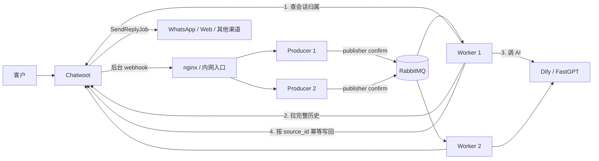
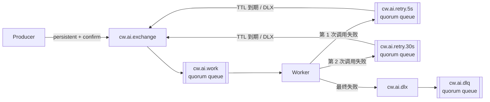
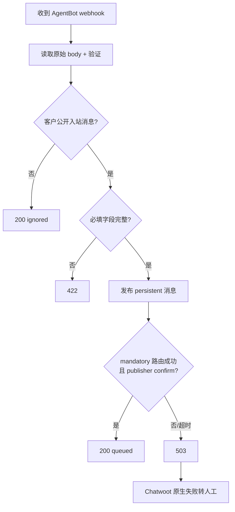
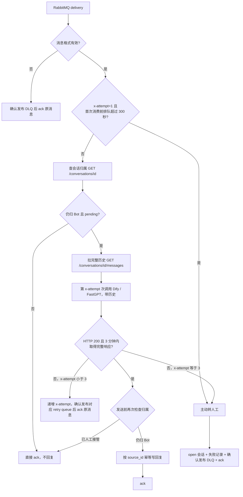

# Chatwoot AI 客服 Bridge 异步回写方案（Node + RabbitMQ，无 Redis 简化版）

> 配套文档：[ai-chatwoot-customer-service-integration.md](./ai-chatwoot-customer-service-integration.md)、[redis必要性.md](./redis必要性.md)
>
> 本方案依据当前项目源码、Chatwoot 官方 AgentBot 工作方式和 RabbitMQ 官方可靠投递机制整理。已确认 Dify / FastGPT 一次响应通常需要约 2 分钟。

## 架构决策记录（ADR）

**2026-07-28 团队评审决定：去掉 Redis，采用纯 RabbitMQ + Chatwoot API 架构。**

原方案（见 git 历史）用 Chatwoot Redis DB 1 做 5 件事：消息去重、同会话顺序、会话锁、Provider 上下文、巡检补偿。团队逐项确认后认为业务上不需要：

| 原 Redis 用途 | 团队决策 | 替代方式 |
|---|---|---|
| 消息去重状态 | 不需要 | 写回复时按 Chatwoot `source_id` 查重 + **数据库唯一索引兜底**（防重复回复） |
| 同会话顺序 | 产品确认不需要保证 | worker 并发处理，不保证顺序 |
| 会话分布式锁 | 不需要 | 允许并发处理同一会话 |
| Provider 上下文 | 不需要 | worker 每次从 Chatwoot 拉完整历史传给 AI（无状态调用） |
| 巡检补偿 | 不考虑 | 依赖 RabbitMQ 重投递 + 监控消息年龄 |

**接受的代价（已签字认可）**：

1. **重复消费会重复调用 AI**：RabbitMQ 是 at-least-once，worker 崩溃/网络抖动导致重投递时，会重新调一次 AI（约 2 分钟 + 一份额度）。`source_id` 只能防重复回复，防不住重复调用。
2. **不保证同会话顺序**：客户连发多条，回复可能乱序，且会并发调用 AI。
3. **AI 并发可能撞 provider 上限**：同一会话多条消息会触发多个并发 AI 调用，靠 `prefetch` + 熔断控制。

未来若产品要求"严格多轮顺序"或"省 AI 额度"，需重新引入外部状态存储（Redis 或等价物）。

---

## 0. 先看结论

Chatwoot 原生支持异步 AgentBot：

```text
客户发消息
  ↓
Chatwoot 后台推送 webhook
  ↓
Bridge Producer 把任务可靠发布到 RabbitMQ
  ↓
RabbitMQ 确认接收后，Bridge 快速返回 200
  ↓
Worker 后台拉历史 + 调用 AI，等待约两分钟
  ↓
Worker 调用 Create New Message API
  ↓
Chatwoot 后台发送到 WhatsApp / 网页聊天等实际渠道
```

Bridge 不在 webhook 请求里等 AI，也不需要把 Chatwoot 全站 `WEBHOOK_TIMEOUT` 调到两分钟。

RabbitMQ 在这里负责保存"Chatwoot 已经交给 Bridge、但尚未处理完成"的任务。**本方案不使用 Redis**，去重依赖 Chatwoot `source_id`，上下文依赖每次拉历史。

生产可靠性的核心规则：

1. **RabbitMQ publisher confirm 成功后才能向 Chatwoot 返回 200。**
2. **消息必须持久化，exchange/queue 必须 durable。**
3. **Worker 使用手动 ack，业务完成前不能确认消息。**
4. **重试消息或 DLQ 消息确认发布成功后，才能 ack 原消息。**
5. **RabbitMQ 是 at-least-once，重复消费会重复调用 AI，业务必须用 `source_id` 防重复回复。**
6. **Dify 和 FastGPT 使用同一失败判定与重试规则：HTTP 状态码不是 200，或 3 分钟内未取得完整响应，均判定失败；首次调用失败后自动重试，单条业务重试链路最多调用 3 次。**

---

## 1. Chatwoot 哪些地方已经异步

### 1.1 客户消息不会等待 AgentBot

当前项目通过：

```ruby
AgentBots::WebhookJob.perform_later(agent_bot.outgoing_url, payload)
```

把 AgentBot webhook 交给后台任务。客户发消息的原始请求不会等待 Bridge。

源码：`app/listeners/agent_bot_listener.rb:67-70`。

### 1.2 webhook 后台任务只需要等 Bridge 快速确认

Chatwoot 后台任务内部执行普通 HTTP POST，默认超时 5 秒：

```ruby
RestClient::Request.execute(..., timeout: webhook_timeout)
```

它等待的是 Bridge 的"RabbitMQ 已可靠接收"，不是 AI 答案。

源码：`app/jobs/webhook_job.rb:4-5`、`lib/webhooks/trigger.rb:33-41`、`lib/webhooks/trigger.rb:108-113`。

### 1.3 AI 答案通过独立 API 延后写回

Chatwoot 官方 AgentBot 流程是：Bot 收到 webhook 后自行处理，再通过 Create New Message API 回写。

回复不放在 webhook HTTP 响应体中。

### 1.4 Chatwoot 向实际渠道发送也是后台任务

Create New Message API 先保存消息，随后 Chatwoot 执行：

```ruby
SendReplyJob.perform_later(id)
```

再把消息发到 WhatsApp、Telegram、网页聊天等渠道。

源码：`app/controllers/api/v1/accounts/conversations/messages_controller.rb:8-13`、`app/models/message.rb:390-393`、`app/jobs/send_reply_job.rb`。

---

## 2. 目标和责任边界

### 2.1 必须做到

1. webhook 正常情况下 1 秒内确认，最长不超过 3 秒；
2. AI 等两分钟不占用 Chatwoot webhook 连接；
3. RabbitMQ 接管的消息在 Worker 崩溃后能够重新投递；
4. **同一客户消息不重复回复**（靠 Chatwoot `source_id`）；
5. 人工中途接管后不发送迟到 AI 答案（靠发送前再次查会话归属）；
6. AI 最终失败、队列等待过久时主动转人工；
7. Producer、Worker 可以独立扩容；
8. RabbitMQ 或 Chatwoot 不可用时有明确兜底。

### 2.2 不需要做（团队确认放弃）

- 不需要保证同一会话多条消息按顺序处理；
- 不需要防止重复调用 AI（接受重投递时的额度浪费）；
- 不需要 Redis 或任何外部状态存储；
- 不需要把 `WEBHOOK_TIMEOUT` 调到 120～180 秒；
- 不需要让 nginx 保持两分钟 webhook 连接；
- 不需要用 webhook 响应体承载 AI 答案；
- 不需要让 Bridge 负责渠道的最终发送。

### 2.3 会话归属以 Chatwoot 状态为准

复用 Chatwoot AgentBot 状态语义：

```text
pending → AgentBot 处理
open    → 人工客服处理
```

Worker 只在以下条件同时满足时发送 AI 回复：

```text
status == pending
assignee 是当前 AgentBot（或为空）
```

人工把 `open` 改回 `pending`，表示重新交给 Bot。

---

## 3. 总体架构



**与原方案的区别**：去掉了 Chatwoot Redis DB 1。Worker 每次处理时从 Chatwoot 拉历史（替代 Provider 上下文缓存），写回复时按 `source_id` 查重（替代 Redis 去重状态）。

### 3.1 Producer

只负责：

- 校验 AgentBot webhook；
- 过滤非客户公开入站消息；
- 把持久消息发布到 RabbitMQ；
- 等待 publisher confirm；
- 快速返回 HTTP 结果。

Producer 不调用 AI，**不操作 Redis**。

### 3.2 RabbitMQ

负责：

- 持久保存待处理任务；
- 把任务分发给 Worker；
- 保存未 ack 的在途消息；
- Worker 断线后重新投递；
- 通过 TTL + Dead Letter Exchange 实现延迟重试；
- 保存最终失败的 DLQ 消息。

### 3.3 Worker

负责：

- 手动消费和 ack；
- 检查会话仍归 Bot；
- **从 Chatwoot 拉完整会话历史**，组装上下文传给 AI；
- 调用 Dify / FastGPT；
- 重试、熔断和并发限制；
- 按 `source_id` 幂等回写 Chatwoot；
- 最终失败时主动转人工。

**不操作 Redis**。

---

## 4. RabbitMQ 队列拓扑

### 4.1 拓扑图



### 4.2 建议实体

| 类型 | 名称 | 用途 |
|---|---|---|
| direct exchange | `cw.ai.exchange` | 正常工作任务入口 |
| quorum queue | `cw.ai.work` | 待处理和处理中任务 |
| direct exchange | `cw.ai.retry` | 重试入口 |
| quorum retry queue | `cw.ai.retry.5s` | 5 秒后重新进入工作队列 |
| quorum retry queue | `cw.ai.retry.30s` | 30 秒后重新进入工作队列 |
| direct exchange | `cw.ai.dlx` | 最终失败入口 |
| quorum queue | `cw.ai.dlq` | 保存最终失败任务 |

两个 retry queue 均为必选：首次调用失败后进入 `cw.ai.retry.5s`，第二次调用失败后进入 `cw.ai.retry.30s`；第三次调用仍失败时不再重试，主动转人工并进入 DLQ。因此一次正常业务处理最多调用 AI 3 次（首次调用 + 2 次自动重试）。

### 4.3 为什么使用 TTL + DLX

不依赖 RabbitMQ delayed-message 插件，使用内置能力：

```text
失败消息发布到固定 retry queue
  ↓
retry queue 的 message TTL 到期
  ↓
Dead Letter Exchange 把消息送回 work exchange
```

使用固定延迟队列，避免同一个队列中不同 per-message TTL 造成队头阻塞。不要对失败消息直接 `nack(requeue=true)`，否则同一条失败消息会立刻反复占用 Worker。

### 4.4 DLX 必须显式加固为 at-least-once

RabbitMQ 默认 dead-letter 转发属于 at-most-once。所有会触发 dead-letter 的源队列均使用 quorum queue，并通过 policy 开启 at-least-once dead-lettering：

| 队列 | 必要策略 |
|---|---|
| `cw.ai.work` | `dead-letter-exchange=cw.ai.dlx`、`dead-letter-routing-key=dlq`、`dead-letter-strategy=at-least-once`、`overflow=reject-publish`、`delivery-limit=10` |
| `cw.ai.retry.5s` | `message-ttl=5000`、`dead-letter-exchange=cw.ai.exchange`、`dead-letter-routing-key=work`、`dead-letter-strategy=at-least-once`、`overflow=reject-publish` |
| `cw.ai.retry.30s` | `message-ttl=30000`，其余同上 |

两套互补机制：Worker 主动重试时先发布到 retry queue、confirm 后才 ack 原消息；Worker 反复崩溃达到 `delivery-limit` 时由 `cw.ai.work` 把毒消息可靠转入 DLQ。

### 4.5 durable、persistent、confirm 缺一不可

```text
exchange durable=true
queue durable=true
message persistent=true / deliveryMode=2
publisher confirm=true
```

---

## 5. Producer 接收流程

### 5.1 正常流程



Producer 总预算建议 3 秒，小于 Chatwoot 默认 5 秒。**无 Redis 登记 step**（原方案的"登记 publishing + 顺序"已删除）。

### 5.2 HTTP 返回值

| 返回 | 使用场景 | 含义 |
|---|---|---|
| `200 queued` | RabbitMQ confirm 成功 | 后续责任转给 Worker |
| `200 ignored` | 明确不是客户公开入站消息 | 正常忽略 |
| `401/403` | 鉴权失败 | 不接受请求 |
| `422` | 客户消息缺少必要字段 | 不能假装成功 |
| `503` | RabbitMQ、confirm channel 不可用或发布超时 | Chatwoot 原生失败转人工 |

> 与原方案的区别：不再有 `200 duplicate`。重复检测全部交给 Worker 写回复时按 `source_id` 查 Chatwoot（见第 8 章）。

禁止先返回 200，再在后台发布 RabbitMQ。

### 5.3 消息属性

```text
messageId   = cw_ai_{accountId}_{messageId}
contentType = application/json
type        = chatwoot.ai.request
timestamp   = 当前 Unix 时间
persistent  = true
mandatory   = true
headers:
  x-attempt = 当前 AI 业务调用序号（首次为 1，重试依次为 2、3）
  x-created-at = 原消息创建时间
```

`mandatory=true` 用于发现 exchange 没有绑定到任何 queue 的配置错误。

### 5.4 Publisher connection

- 使用长期 AMQP connection，不要每个 webhook 新建连接；
- Producer 使用独立 confirm channel；
- 自动重连后重新声明或验证 topology；
- connection/channel 未 ready 时 `/health/ready` 返回 503；
- publish confirm 超过预算时不能返回 200。

---

## 6. Worker 消费和手动 ack

### 6.1 主流程



**与原方案的区别**：
- 去掉了开头"Redis 已 done/handed_off?"检查、会话顺序队头检查、会话锁；
- 新增"拉完整历史"step（替代 Provider 上下文缓存）；
- 写回复时按 `source_id` 查 Chatwoot 去重（唯一的重复防护）。

### 6.2 重复消费的处理（重要）

RabbitMQ at-least-once 下，**同一条消息被重复投递是正常现象**（worker 崩溃、ack 丢失、网络抖动、发版重启）。本方案的处理：

| 重复消费的后果 | 是否发生 | 说明 |
|---|---|---|
| 重复调用 AI | **会** | 调 AI 在写回复之前，重投递必然重调一次（接受额度浪费） |
| 重复回复给客户 | **不会** | createReply 内 `findMessageBySourceId(source_id)` 查到已存在就跳过 |

AI 一次通常约 2 分钟，处理时间越长越容易在中间出问题，所以重复调 AI 不是小概率。这是本方案明确接受的代价。

`AI_MAX_ATTEMPTS=3` 限制的是应用主动发起的正常业务重试链路。由于本方案没有 Redis 或等价的共享调用状态，Worker 在 AI 调用后、ack 前崩溃，或者 retry publish confirm 成功后原消息 ack 丢失时，RabbitMQ 重投递仍可能造成额外的物理 AI 调用。若要求包括这类基础设施异常在内也绝对不超过 3 次，必须增加外部原子调用计数/幂等状态，或使用 AI 平台提供的幂等键；当前无 Redis 方案不作此保证。

### 6.3 ack 规则

使用 `noAck=false`。只有以下情况才能 ack 原消息：

- Chatwoot 回复已经明确创建或通过 `source_id` 查到；
- 会话已经由人工接管，AI 无需再处理；
- 主动转人工成功，失败记录和 DLQ 已可靠发布；
- 重试消息已经收到 RabbitMQ publisher confirm。

如果发布 retry/DLQ 失败：不 ack 原消息，必要时关闭 consumer channel，RabbitMQ 会把未 ack 消息重新入队并再次投递。

### 6.4 prefetch 和并发（替代会话锁）

```text
RABBITMQ_PREFETCH=10
WORKER_CONCURRENCY=10
```

原方案用 Redis 锁保证"同一会话同时只一个 worker"。**本方案去掉锁后，同一会话的多条消息可能被不同 worker 并发处理**。为避免并发失控撞 provider 上限：

- `prefetch` 限制单个 worker channel 同时持有的未 ack 消息数，形成背压；
- `WORKER_CONCURRENCY` 控制 worker 内部并发；
- provider 熔断（CLOSED/OPEN/HALF_OPEN）在故障时快速转人工，不让消息堆在重试里。

> 注意：`prefetch` 是全局并发控制，不是"按会话串行"。同一会话两条消息仍可能被两个 worker 同时取走、并发调 AI、乱序回复。产品已确认接受。

### 6.5 Worker 崩溃

Worker 进程/connection/channel 关闭时，RabbitMQ 会重新投递未 ack 消息。重新投递会重复执行：重新拉历史、重新调 AI、按 `source_id` 写回复（查到已存在则跳过）。

---

## 7. AI 超时、重试和熔断

### 7.1 时间预算

```text
Producer webhook 总预算：3 秒
RabbitMQ publish confirm：最多 2 秒且包含在 Producer 预算内
AI 单次调用：180 秒（必须在该时间内取得完整响应）
AI 三次调用及固定重试延迟：最多 575 秒（180 × 3 + 5 + 30）
整个 Worker 业务任务（从首次 AI 调用起）：660 秒
Chatwoot API 单次调用：8 秒
首次消费前最大队列等待：300 秒（只在 x-attempt=1 时判断）
```

RabbitMQ 的 consumer acknowledgement timeout 必须大于 Worker job 总预算和停机等待时间，上线时必须显式核对。

### 7.2 Node 调用 Dify / FastGPT 的统一失败判定与重试规则

两个 AI 平台必须共用同一套 provider 调用契约，不得分别配置异常分类或重试次数：

| 判定项 | 统一规则 |
|---|---|
| 调用成功 | HTTP 状态码严格等于 200，且从发起请求起 180 秒内取得完整响应 |
| 调用失败 | HTTP 状态码不是 200；或发起请求后 180 秒内未取得完整响应。响应流中断、响应体未完整读取也按未取得完整响应处理 |
| 第 1 次失败 | 自动发布到 `cw.ai.retry.5s`，5 秒后进行第 2 次调用 |
| 第 2 次失败 | 自动发布到 `cw.ai.retry.30s`，30 秒后进行第 3 次调用 |
| 第 3 次失败 | 不再调用 AI，主动转人工并将失败消息可靠发布到 DLQ |
| 任意一次成功 | 立即停止后续重试，继续发送前归属检查和幂等回写 |

HTTP 4xx（包括参数错误、鉴权错误、429）和 5xx 均属于“HTTP 非 200”，不设置不重试例外。`x-attempt` 取值只允许 1～3，`AI_MAX_ATTEMPTS=3`。

其他操作继续使用各自策略：

| 操作 | 策略 |
|---|---|
| Chatwoot 切换 open | 直接 ack，不回复 |
| 创建 Chatwoot 回复 | 不盲目重试，先按 `source_id` 查询 |

### 7.3 熔断

```text
CLOSED：正常调用
  ↓ 短时间大量失败
OPEN：尚未开始第 1 次调用的新任务不调用 AI，快速转人工
  ↓ 冷却
HALF_OPEN：少量探测
  ↓
成功恢复，失败继续 OPEN
```

熔断后不要把尚未开始调用的新消息长期留在 work queue；按业务规则主动转人工。已经完成首次调用并进入自动重试链路的消息仍执行完最多 3 次的统一重试规则，不能因 provider 类型或 HTTP 状态码而提前跳过。

---

## 8. 回复幂等（本方案唯一的去重手段）

### 8.1 为什么必须幂等

RabbitMQ confirm 或 consumer ack 可能在网络中丢失：

```text
Worker 调用 Create New Message
  ↓
Chatwoot 已保存
  ↓
响应丢失或 Worker 随后崩溃
  ↓
RabbitMQ 重新投递原消息
  ↓
Worker 重新调一次 AI（无法避免）→ 写回复时必须防重复
```

### 8.2 稳定 `source_id`

```text
source_id = ai-bridge:{accountId}:{incomingMessageId}:{reply}
```

`createReply` 流程（`lib/chatwoot.js`）：

1. 创建前 `findMessageBySourceId` 查询是否已有相同 `source_id`；
2. 已有 → 视为成功，返回 duplicate，不再创建；
3. API 超时先查询，不直接重发；
4. 查询也无法确定时转人工，不冒险重复回复。

> **`source_id` 只防"重复回复"，不防"重复调用 AI"**。重复调用 AI 的代价（额度 + 时间）由本方案接受。要彻底防重复调用，必须引入"消息处理状态"的外部存储（即 Redis 或等价物），见 [redis必要性.md](./redis必要性.md)。

### 8.3 使用 AgentBot access token

Bridge 调用 Create New Message 和切换状态时使用 AgentBot 自己的 access token，不借用人工管理员 token。这样 outgoing message 才正确标记为 AgentBot。

### 8.4 source_id 必须加唯一索引（数据库级强幂等）

单会话锁去掉后，应用层 `source_id` 查重在并发竞态下可能漏判（见第 6.2 节：consumer heartbeat 误判导致同一消息被两个 worker 同时处理，二者几乎同时 `findMessageBySourceId` 都查不到 → 都创建 → 重复回复）。因此 **必须给 Chatwoot `messages` 表的 `source_id` 字段加唯一索引**，作为数据库级兜底，根治低概率但真实的重复回复。

迁移示例（Rails migration）：

```ruby
# 部分唯一索引：仅对非空 source_id 生效（Chatwoot 自身消息 source_id 可能为空）
add_index :messages, :source_id, unique: true, where: "source_id IS NOT NULL"
```

注意事项：

- Chatwoot 自身消息（人工客服发的、模板消息等）`source_id` 可能为空，必须用**部分索引**（`where source_id IS NOT NULL`），否则空值之间会触发唯一冲突；
- 加索引前先排查现有重复：`SELECT source_id, COUNT(*) FROM messages WHERE source_id IS NOT NULL GROUP BY source_id HAVING COUNT(*) > 1`，有则先清理；
- 加索引后，并发竞态下第二个 `createReply` 插入会抛唯一约束错误，worker 捕获后按"已存在"处理（视为成功，不重试）；
- `lib/chatwoot.js` 的 `createReply` 要识别唯一约束冲突（PostgreSQL 错误码 `23505` / `unique_violation`），转为 duplicate 返回。

> 应用层 `findMessageBySourceId` 是快路径（挡掉绝大多数重复），数据库唯一索引是兜底（挡掉竞态漏判）。两层配合，重复回复被根治。注意唯一索引**只防重复回复，不防重复调用 AI**（调用在写入之前）。

---

## 9. 转人工和失败责任

### 9.1 发布前失败

RabbitMQ 不可用、消息无法路由或 publisher confirm 超时：

```text
Producer 返回 503
  ↓
Chatwoot webhook 失败处理
  ↓
pending 会话变为 open
  ↓
记录 AgentBot 失败 activity
```

保持 `keep_pending_on_bot_failure=false`。

### 9.2 RabbitMQ 已确认后的失败

Producer 已返回 200 后，Worker 必须主动：

1. 把会话切换为 `open`；
2. 创建一次性内部失败备注或 activity；
3. 将失败消息发布到 DLQ 并等待 confirm；
4. ack 原 delivery；
5. 告警并结束同会话后续 AI 任务。

### 9.3 AI 主动转人工

AI 返回 `[HUMAN_HANDOFF_REQUIRED]` 时：

1. 去掉标记；
2. 可发送正常转人工说明；
3. 把会话切换为 `open`；
4. ack 当前 delivery。

### 9.4 排队过久

任务等待超过 `MAX_QUEUE_WAIT_MS` 时主动转人工。无限排队技术上没丢消息，但业务上已经失败。

---

## 10. AgentBot webhook 鉴权差异

Chatwoot 官方文档描述 `X-Chatwoot-Signature`、`X-Chatwoot-Timestamp` 和 `X-Chatwoot-Delivery`，但当前项目中 AgentBot 请求默认不会自动携带 HMAC 签名头。

生产推荐：

1. 给 AgentBot 增加独立 webhook secret（写入 `bot_config['webhook_secret']`）；
2. Listener 把 secret 和随机 delivery ID 传给 WebhookJob；
3. Producer 使用原始 body 验证 HMAC；
4. 验证 timestamp 防重放。

改造前，Bridge endpoint 只能放在私有网络并限制 Chatwoot/Sidekiq 访问，不直接暴露公网。

---

## 11. RabbitMQ 部署

### 11.1 单节点起步

```yaml
rabbitmq:
  image: rabbitmq:4-management
  hostname: rabbitmq
  restart: always
  environment:
    RABBITMQ_DEFAULT_USER: ${RABBITMQ_USER}
    RABBITMQ_DEFAULT_PASS: ${RABBITMQ_PASSWORD}
    RABBITMQ_DEFAULT_VHOST: chatwoot_ai
  volumes:
    - rabbitmq_data:/var/lib/rabbitmq
  healthcheck:
    test: ['CMD', 'rabbitmq-diagnostics', '-q', 'ping']
    interval: 10s
    timeout: 5s
    retries: 5
  ports:
    - '127.0.0.1:15672:15672'
  deploy:
    resources:
      limits:
        memory: 1G
        cpus: '2'

volumes:
  rabbitmq_data:
```

AMQP 5672 只供 Compose 内部服务访问，不暴露宿主机。管理端口 15672 也应限制在本机。

### 11.2 单节点的保障边界

单节点 + durable queue + persistent message + publisher confirm 可以抵抗：

- Producer/Worker 重启；
- RabbitMQ 容器正常重启；
- Worker 处理中崩溃；
- 普通网络断开和重连。

它不能抵抗 RabbitMQ 主机或数据盘永久损坏。需要 Broker 高可用时使用 3 节点 RabbitMQ 集群和 3 副本 quorum queue。

### 11.3 vhost 和权限

使用独立 vhost `chatwoot_ai` 和独立用户，不使用默认 guest 账号。最小权限：

- Producer：写 work exchange，读取 publisher return/confirm；
- Worker：读 work queue，写 retry exchange 和 DLX；
- topology bootstrap：单独拥有 configure 权限。

跨主机访问 RabbitMQ 时启用 TLS。

---

## 12. nginx、健康检查和停机

### 12.1 nginx

```nginx
upstream bridge_producer {
  server 127.0.0.1:8788 max_fails=3 fail_timeout=10s;
  server 127.0.0.1:8789 max_fails=3 fail_timeout=10s;
  keepalive 32;
}

location /chatwoot/agent-bot {
  proxy_pass http://bridge_producer;
  proxy_connect_timeout 1s;
  proxy_read_timeout 4s;
  proxy_next_upstream off;
}
```

`proxy_next_upstream off` 避免 nginx 在发布结果不明时自动换实例重发。

### 12.2 健康检查

```text
Producer：
  /health/live  → Node 活着
  /health/ready → RabbitMQ connection/confirm channel ready + 未停机

Worker：
  live  → Node 和事件循环正常
  ready → RabbitMQ consumer 已注册
```

> 与原方案的区别：`/health/ready` 不再检查 Redis（已去掉）。

### 12.3 停机

**Producer 停机**：readiness 变 503 → 停止接收 webhook → 等待 outstanding publisher confirms → 关闭 confirm channel 和 connection。

**Worker 停机**：`basic.cancel` 停止领取新消息 → 等当前 delivery 在 grace period 内完成 → 成功则 ack、超时则中断 AI 并关闭 consumer channel → 未 ack 消息由 RabbitMQ 重新投递。

---

## 13. 容量估算

AI 平均响应 120 秒：

```text
所需 AI 并发 ≈ 目标 RPS × 120
```

| 目标吞吐 | 理论 AI 并发需求 |
|---:|---:|
| 每分钟 30 条（0.5 RPS） | 约 60 |
| 每分钟 60 条（1 RPS） | 约 120 |
| 5 RPS | 约 600 |
| 10 RPS | 约 1200 |

> 去掉锁后，同一会话连发多条会放大 AI 并发（N 条 = N 个并发调用）。容量规划时要按"峰值并发消息数"而非"会话数"估算，并确认 provider 并发上限。

如果 provider 只允许 100 并发：理论吞吐 ≈ 100 ÷ 120 ≈ 0.83 RPS。增加 RabbitMQ 或 Worker 数量不能突破 provider 上限，只会增加 ready 消息积压。

---

## 14. 用户等待体验

两分钟对客户较长，可异步发送一次确认消息：

```text
"已收到你的问题，正在查询，请稍候。"
```

- 使用稳定 `source_id` 防重复；
- 首次消费前超过最大队列等待时间时主动转人工；
- 确认消息不能延长 webhook 响应。

> 原方案的"同会话冷却时间"和"短句聚合"需要外部状态存储，本方案无 Redis 不支持，已移除。若未来需要，必须重新引入状态存储。

---

## 15. 日志、指标和告警

### 15.1 全链路字段

```text
reqId / rabbitMessageId / accountId / conversationId / messageId
provider / attempt / redelivered / result / duration
```

### 15.2 RabbitMQ 指标

| 指标 | 作用 |
|---|---|
| work queue messages_ready | 等待处理数量 |
| messages_unacknowledged | Worker 在途数量 |
| 最老消息年龄 | 客户真实等待时间 |
| publisher confirm latency/nack/timeout | Producer 接收可靠性 |
| redelivered 数量 | **重复消费频率（直接关系 AI 额度浪费）** |
| retry queue 数量 | 临时失败量 |
| DLQ 数量 | 最终失败量 |
| consumer 数量/capacity | Worker 是否在线 |
| memory/disk alarm | Broker 是否停止接收消息 |

> `redelivered` 数量在本方案里特别重要：它直接反映"重复调 AI"的频率，是该代价的可观测指标。

### 15.3 业务指标

- webhook queued/ignored/503；
- AI P50/P95/P99；
- AI HTTP 非 200、180 秒未完整响应、各 attempt 结果、熔断；
- Chatwoot 回复 `source_id` 幂等命中；
- 主动转人工数量；
- **AI 调用次数 vs 客户消息数**（比值升高可能来自正常自动重试或 RabbitMQ 重复消费，需结合 `attempt`、`redelivered` 区分）。

立即告警：

- RabbitMQ connection/channel 不可用；
- publisher confirm 超时或 nack；
- work queue 最老消息超过阈值；
- consumer 数量为 0；
- DLQ 出现新消息；
- RabbitMQ memory/disk alarm；
- Chatwoot API 连续失败；
- AI 调用次数 / 客户消息数比值异常升高，且无法由正常的最多 3 次业务调用解释。

---

## 16. 推荐环境变量

```text
# RabbitMQ
RABBITMQ_HOST=rabbitmq
RABBITMQ_PORT=5672
RABBITMQ_VHOST=chatwoot_ai
RABBITMQ_USER=chatwoot_bridge
RABBITMQ_PASSWORD=change-me
RABBITMQ_EXCHANGE=cw.ai.exchange
RABBITMQ_WORK_QUEUE=cw.ai.work
RABBITMQ_WORK_ROUTING_KEY=work
RABBITMQ_RETRY_EXCHANGE=cw.ai.retry
RABBITMQ_RETRY_QUEUE_5S=cw.ai.retry.5s
RABBITMQ_RETRY_QUEUE_30S=cw.ai.retry.30s
RABBITMQ_RETRY_ROUTING_KEY_5S=retry.5s
RABBITMQ_RETRY_ROUTING_KEY_30S=retry.30s
RABBITMQ_DLX=cw.ai.dlx
RABBITMQ_DLQ=cw.ai.dlq
RABBITMQ_DLQ_ROUTING_KEY=dlq
RABBITMQ_DEAD_LETTER_STRATEGY=at-least-once
RABBITMQ_QUEUE_OVERFLOW=reject-publish
RABBITMQ_DELIVERY_LIMIT=10
RABBITMQ_PUBLISH_CONFIRM_MS=2000
RABBITMQ_PREFETCH=10

# Producer
PRODUCER_DEADLINE_MS=3000
BODY_LIMIT_BYTES=1048576

# Worker / AI
AI_ATTEMPT_TIMEOUT_MS=180000
AI_MAX_ATTEMPTS=3
JOB_DEADLINE_MS=660000
WORKER_CONCURRENCY=10
# 只限制 x-attempt=1 的首次消费前排队时间，不阻断第 2、3 次调用
MAX_QUEUE_WAIT_MS=300000
# 拉取会话历史的消息条数上限（避免超长会话撑爆 AI token）
CW_HISTORY_MAX_MESSAGES=20

# Chatwoot API
CHATWOOT_BASE_URL=http://rails:3000
CHATWOOT_API_ACCESS_TOKEN=AgentBot自己的token
CW_TIMEOUT_MS=8000
CW_STATE_MAX_ATTEMPTS=3
CW_MESSAGE_CREATE_MAX_ATTEMPTS=1

# 熔断
CB_WINDOW_MS=30000
CB_FAILURE_THRESHOLD=0.5
CB_MIN_SAMPLES=20
CB_COOLDOWN_MS=30000

# 运行
PRODUCER_SHUTDOWN_MS=5000
WORKER_SHUTDOWN_MS=180000
METRICS_ENABLED=true
LOG_LEVEL=info
```

> 已删除所有 `BRIDGE_REDIS_*`、`MESSAGE_STATE_TTL_SEC`、`PROVIDER_CONTEXT_TTL_SEC`、`ORDER_*`、`LOCK_*`、`RECONCILE_*` 等原 Redis 相关变量。新增 `CW_HISTORY_MAX_MESSAGES` 控制 worker 拉历史的大小。

---

## 17. 分阶段落地

### 阶段 A：RabbitMQ 基础链路

| 步骤 | 改动 | 验证 |
|---|---|---|
| 1 | 部署单节点 RabbitMQ、持久 volume、管理 UI | 容器重启后 durable queue 仍存在 |
| 2 | 声明 exchange、work/retry/DLQ quorum queue，应用 at-least-once DLX policy | routing、TTL、DLX、delivery-limit 正常 |
| 3 | Producer persistent publish + mandatory + confirm | 未路由、nack、超时均返回 503 |
| 4 | Worker manual ack，prefetch 从 10 起步 | Worker 崩溃后消息重新投递 |

### 阶段 B：业务可靠性

| 步骤 | 改动 | 验证 |
|---|---|---|
| 1 | Worker 查会话归属 + 拉历史 + 调 AI 并回写 | webhook 小于 1 秒，AI 两分钟后回复 |
| 2 | 会话归属前后双检查 | 人工中途接管后不发迟到答案 |
| 3 | `source_id` 幂等 | Worker 重投递不产生重复回复（但会重复调 AI，符合预期） |
| 4 | Dify / FastGPT 统一失败判定 + 两级 retry queue + confirm-before-ack | 非 200 或 3 分钟未完整响应时自动重试；最多调用 3 次；重试发布失败时原消息不丢 |
| 5 | 主动转人工 + DLQ | AI 最终失败后 open 并留存 DLQ |
| 6 | 熔断和并发限制 | provider 故障不形成热重试 |

### 阶段 C：扩容和高可用

```text
单 Producer + 单 Worker + 单 RabbitMQ
  ↓
多 Producer + 多 Worker + 单 RabbitMQ
  ↓
多 Producer + 多 Worker + 3 节点 RabbitMQ quorum queues
```

---

## 18. 上线验收清单

### 正常流程

- webhook 1 秒内返回；
- Chatwoot 默认 5 秒超时无需调整；
- Producer 只在 publisher confirm 后返回 200；
- AI 两分钟后只产生一条回复（`source_id` 保证不重复回复）；
- Chatwoot 后台正常发送到实际渠道。

### Producer 和 RabbitMQ

- RabbitMQ 停止后 Producer 返回 503；
- exchange 无绑定时 mandatory return 被识别；
- confirm nack/timeout 不返回假成功；
- RabbitMQ 正常重启后持久消息仍在；
- work/retry quorum queue 已启用 at-least-once dead-lettering 和 `overflow=reject-publish`；
- Worker 反复崩溃达到 `delivery-limit` 后，毒消息可靠进入 DLQ。

### Worker

- Worker 处理中被杀，未 ack 消息重新投递；
- 自动 ack 已关闭；
- prefetch 不为 0；
- retry publish confirm 后才 ack 原消息；
- DLQ publish confirm 后才 ack 最终失败消息；
- 人工中途接管后迟到答案被丢弃；
- Dify 和 FastGPT 返回任意 HTTP 非 200 状态码时，均按相同规则进入自动重试；
- 任一平台在 180 秒内未取得完整响应时，中止本次调用并进入自动重试；
- 第 1 次失败后等待 5 秒调用第 2 次，第 2 次失败后等待 30 秒调用第 3 次；
- 任意一次成功后不再重试，连续 3 次失败后主动转人工并进入 DLQ。

### 幂等（本方案重点）

- 相同 webhook 重复到达不产生重复回复（靠 `source_id`）；
- **`messages.source_id` 已加部分唯一索引**（`where source_id IS NOT NULL`），数据库级兜底防并发竞态重复回复；
- `createReply` 能识别唯一约束冲突（PG 错误码 23505）并转为 duplicate 处理；
- confirm/ack 丢失造成重复 delivery 时结果仍唯一（回复层面）；
- **重复 delivery 会重复调用 AI，基础设施异常时物理调用次数可能超过业务重试上限 3 次**；监控 `redelivered`、`attempt` 和“AI 调用次数/客户消息数”比值，确认额度浪费在可接受范围。

### 安全和运维

- RabbitMQ 不使用 guest 用户；
- 独立 vhost、最小权限；
- AMQP 和管理 UI 不直接暴露公网；
- RabbitMQ data volume 持久化；
- memory/disk alarm、DLQ、consumer=0 均有告警；
- AgentBot webhook HMAC 改造前只走私有网络。

---

## 19. 最终责任边界

```text
Chatwoot：保存客户消息、后台通知 Bot、保存 AI 回复、后台发往渠道
Producer：验签、RabbitMQ 持久发布和 confirm
RabbitMQ：保存待处理/重试/DLQ消息、未 ack 重投递
Worker：拉历史、按统一规则调用 AI（单次 3 分钟、最多 3 次）、手动 ack、重试转发、source_id 幂等回复、失败转人工
Dify/FastGPT：生成答案
```

> 与原方案的区别：删除了"Chatwoot Redis DB 1：去重、会话顺序、锁、Provider 上下文"这一行。

最终判断：

> Chatwoot webhook 在几秒内结束；RabbitMQ confirm 后才接管责任；Dify / FastGPT 均以“HTTP 非 200 或 3 分钟内未取得完整响应”判定调用失败，正常业务重试链路最多调用 3 次；成功后通过官方消息 API 回写。Worker 只有在业务结果或后继消息已经可靠保存后才 ack。RabbitMQ 重复消费仍可能额外调用 AI（接受），但 `source_id` 保证不重复回复。单节点 RabbitMQ 的主机/磁盘故障仍属于风险边界，需要 3 节点 quorum queue 才能提供 Broker 高可用。

---

## 20. 文件规划

### Bridge

| 文件 | 作用 |
|---|---|
| `producer.js` | webhook、校验、RabbitMQ confirm publish |
| `worker.js` | RabbitMQ manual consumer、拉历史、AI 调用、ack、转人工 |
| `lib/config.js` | 环境变量和预算校验 |
| `lib/rabbitmq.js` | connection、confirm channel、consumer channel、重连 |
| `lib/topology.js` | exchange、quorum work/retry/DLQ queue 和 policy 声明 |
| `lib/retry.js` | retry queue 选择和 job 总预算 |
| `lib/circuit-breaker.js` | provider 熔断 |
| `lib/chatwoot.js` | 拉历史、状态检查、`source_id` 幂等回复、转人工 |
| `lib/providers/dify.js` | Dify 调用和超时 |
| `lib/providers/fastgpt.js` | FastGPT 调用和超时 |
| `lib/logger.js` | pino 日志 |
| `lib/metrics.js` | Prometheus 指标 |

> 已删除：`lib/message-state.js`、`lib/conversation-order.js`、`lib/dlock.js`、`lib/provider-context.js`、`lib/redis.js`、`lib/reconciler.js`（均为 Redis 相关）。

建议 Node 依赖：

```text
amqplib
amqp-connection-manager
pino
prom-client
```

> 已删除 `ioredis` 依赖。

### Chatwoot 行为依据

| 文件 | 作用 |
|---|---|
| `app/listeners/agent_bot_listener.rb` | 异步创建 AgentBot webhook job |
| `app/jobs/agent_bots/webhook_job.rb` | AgentBot webhook 重试规则 |
| `lib/webhooks/trigger.rb` | HTTP 投递、5 秒默认超时、失败转人工 |
| `app/controllers/api/v1/accounts/conversations/messages_controller.rb` | Create New Message |
| `app/controllers/api/v1/accounts/conversations_controller.rb` | 查会话归属、拉消息历史 |
| `app/models/message.rb` | 保存后创建 SendReplyJob |
| `app/jobs/send_reply_job.rb` | 后台发送到实际渠道 |
