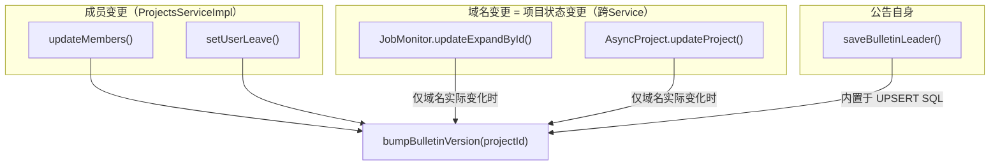

# 后端接口开发计划：个人设置别名 + 群公告（v2 优化版）

## 当前进度总结（2026-04-16 更新）

### 「个人设置别名」— 已完成

- [x] `DB/ld-project-update.sql` — `ALTER TABLE pre_users ADD COLUMN alias_name`
- [x] `Users.java` / `AdminUser.java` / `UserInfo.java` — `aliasName` 字段
- [x] `ProjectCoreMemberVO.java` — `aliasName` 字段
- [x] `ProjectUsersMapper.xml` — `role_type_code IN ('1','2','3','4','5')`
- [x] `ProjectsServiceImpl.getProjectCoreMembers` — 通过 `UserInfo` 缓存设置 `aliasName`

### 「群公告」— 待开发（以下为优化后的计划）

---

## 项目架构概要

- **后端**：Spring Boot 2.2.5 + MyBatis-Plus + Spring Cloud Gateway
- **网关端口**：8444，`/phoenixtask/projects/*` -> project 服务 `/projects/*`
- **数据库**：MySQL，表前缀 `pre_`，主库 `ld_project`
- **统一返回**：`Result<T>` = `{ret, data, msg}`
- **当前用户**：`UserUtil.getUserId()` / `UserUtil.getUser()`

---

## 一、数据库变更

### 1.1 `pre_users` 表新增 `alias_name` 字段（已完成）

### 1.2 新建 `pre_project_bulletin` 表

采用「主记录 + 用户已读记录合一」设计，通过版本号实现未读提醒：

```sql
CREATE TABLE pre_project_bulletin (
  id          BIGINT AUTO_INCREMENT PRIMARY KEY,
  project_id  BIGINT       NOT NULL COMMENT '项目ID',
  user_id     BIGINT       NOT NULL DEFAULT 0 COMMENT '0=公告主记录，>0=用户已读记录',
  total_leader VARCHAR(100) DEFAULT '' COMMENT '总负责人（仅主记录有效）',
  content_version INT      NOT NULL DEFAULT 0 COMMENT '主记录=当前版本号；用户记录=已读版本号',
  updated_at  DATETIME DEFAULT CURRENT_TIMESTAMP ON UPDATE CURRENT_TIMESTAMP,
  created_at  DATETIME DEFAULT CURRENT_TIMESTAMP,
  UNIQUE KEY uk_project_user (project_id, user_id)
) COMMENT='项目群公告与已读状态';
```

**核心机制**：
- `user_id=0` 行 = 公告主记录，存 `total_leader` + `content_version`（全局版本号）
- `user_id>0` 行 = 该用户已读的版本号
- **未读判定**：主记录 `content_version` > 用户记录 `content_version`（或用户记录不存在）
- **标记已读**：`UPDATE ... SET content_version = (SELECT content_version FROM 主记录) WHERE user_id=当前用户`
- **多次未读一次消除**：已读后版本号直接对齐主记录，天然覆盖所有历史未读

---

## 二、群公告接口设计（4 个接口）

所有接口在 `ProjectsController` 中新增，委托 `IProjectBulletinService`。

### 2.1 获取公告信息

```
POST /projects/getBulletinInfo?projectId={id}
Response: { ret: 0, data: { totalLeader: "张三" }, msg: "" }
```

逻辑：查询 `pre_project_bulletin WHERE project_id=? AND user_id=0`，不存在则返回空字符串。

### 2.2 保存总负责人

```
POST /projects/saveBulletinLeader
Body: { projectId: 123, totalLeader: "张三" }
Response: { ret: 0, data: null, msg: "" }
```

逻辑：`INSERT ... ON DUPLICATE KEY UPDATE total_leader=?, content_version=content_version+1`（保存即递增版本号触发提醒）。

### 2.3 获取未读状态

```
POST /projects/getBulletinReadStatus?projectId={id}
Response: { ret: 0, data: { hasUpdate: true }, msg: "" }
```

逻辑：单条 SQL 比较主记录和用户记录的 `content_version`。

### 2.4 标记已读

```
POST /projects/markBulletinRead
Body: { projectId: 123 }
Response: { ret: 0, data: null, msg: "" }
```

逻辑：`INSERT ... ON DUPLICATE KEY UPDATE content_version = (SELECT content_version FROM 主记录)`。

---

## 三、版本号递增触发点分析（重点优化部分）

### 3.0 设计原则

需求要求「群公告弹窗里的**任一字段**信息变更时，对所有可见此项目的账号展示提醒」。群公告展示的字段包括：

- 网站域名（`domain_record`）
- 项目状态 = **「未上线 / 已上线」（根据网站是否绑定域名判断）** — 即 `domain_record` 的衍生值，域名从无到有 = 上线，从有到无 = 下线
- 运营项目经理 / 售后专员（角色成员变更）
- 总负责人（`total_leader`，在 saveBulletinLeader 中已内置递增）

**关键判断：「项目状态」不是后端的 `projectStatusCode`**（进行中/等待/暂停/中止/完结），而是前端根据 `domainRecord` 是否为空来展示「已上线/未上线」。因此 `discontinue/complete/waiting/pause` 等后端状态变更方法**不需要**注入 bump 钩子，域名变更的钩子（hooks-domain）已天然覆盖了「项目状态」的变化。

因此只需在以下代码位置注入 `bumpBulletinVersion(projectId)` 调用。

### 3.1 项目成员变更 — 3 个入口

| 方法/文件 | 行号 | 注入位置 | 说明 |
|-----------|------|----------|------|
| `ProjectsServiceImpl.updateMembers(...)` | 2178 | 在 `updateProjectMembers` 成功返回后 | 前端/内部成员编辑的主入口 |
| `ProjectsServiceImpl.updateMembersForPy(...)` | 5387 | 在调用 `updateMembers` 之后 | Python 外部调用入口（内部会调 updateMembers，注意避免双重 bump） |
| `ProjectsServiceImpl.setUserLeave(Long userId)` | 6488 | 在删除成员后，需查出该用户关联的所有 projectId，逐一 bump | 用户离职场景 |

**关于 `updateMembersForPy` 避免双重 bump**：由于它内部调用了 `updateMembers`，如果在 `updateMembers` 中已经 bump，则 `updateMembersForPy` 无需再 bump。建议 **只在 `updateMembers` 末尾** 统一 bump，`updateMembersForPy` 不额外处理。

**`selectSimpleProjectByNameAndDomain`（行7197）**虽会静默插入 `project_users`，但这属于「查询时自动加入项目」的读性质操作，并非业务意义上的成员角色变更，**不需要** bump。

**`updateLocalServiceManagerByCity`（行7391）**会增删本地服务经理（`LOCAL_STAFF_SERVICE_MANAGER`）。该角色不在群公告展示范围内（群公告只展示项目经理 + 售后专员），**不需要** bump。

### 3.2 域名变更 — 2 个入口（跨 Service 类，同时覆盖「项目状态」变化）

| 方法/文件 | 行号 | 注入位置 | 说明 |
|-----------|------|----------|------|
| `ProjectJobMonitorServiceImpl.updateExpandById(...)` | 153 | 在 `projectsService.updateById` 之后 | Job/定时任务同步域名 |
| `AsyncProjectService.updateProject(...)` | 308 | 在 `projectsService.updateById`（行752）之后 | 异步同步项目全量信息 |

**`AsyncProjectService.saveNewProject`** 是新建项目时写入域名，新项目不存在历史公告，**不需要** bump。

**优化建议**：对域名变更做 **值变更检测**，仅当 `domainRecord` 实际发生变化时才 bump，避免定时同步任务导致无意义的版本号膨胀：

```java
// 在 updateExpandById 中
Projects oldProject = projectsService.getById(id);
String oldDomain = oldProject != null ? oldProject.getDomainRecord() : "";
if (!Objects.equals(oldDomain, domain)) {
    projectsService.updateById(project);
    bulletinService.bumpBulletinVersion(id);
} else {
    projectsService.updateById(project);
}
```

同理 `AsyncProjectService.updateProject` 中，在 `projectsService.updateById` 之前比对新旧 `domainRecord`。

### 3.3 触发点全景图



---

## 四、需要新建的文件

| 文件 | 说明 |
|------|------|
| `project/.../entity/PO/ProjectBulletin.java` | `@TableName("pre_project_bulletin")`，字段：id, projectId, userId, totalLeader, contentVersion, updatedAt, createdAt |
| `project/.../entity/BO/BulletinLeaderBO.java` | 请求体：projectId(Long), totalLeader(String) |
| `project/.../entity/BO/BulletinReadBO.java` | 请求体：projectId(Long) |
| `project/.../mapper/ProjectBulletinMapper.java` | 自定义方法：bumpVersion, getReadStatus, markRead |
| `project/.../mapper/xml/ProjectBulletinMapper.xml` | 上述方法的 SQL 实现 |
| `project/.../service/IProjectBulletinService.java` | 接口定义 |
| `project/.../service/impl/ProjectBulletinServiceImpl.java` | 业务实现 |

## 五、需要修改的现有文件

| 文件 | 修改内容 |
|------|----------|
| `DB/ld-project-update.sql` | 追加 `CREATE TABLE pre_project_bulletin` |
| `ProjectsController.java` | 新增 4 个群公告接口方法，注入 `IProjectBulletinService` |
| `ProjectsServiceImpl.java` | 注入 `IProjectBulletinService`，在 `updateMembers` / `setUserLeave` 中调用 `bumpBulletinVersion` |
| `ProjectJobMonitorServiceImpl.java` | 注入 `IProjectBulletinService`，在 `updateExpandById` 中加域名变更检测 + bump |
| `AsyncProjectService.java` | 注入 `IProjectBulletinService`，在 `updateProject` 中加域名变更检测 + bump |

## 六、关键 SQL 设计

### 6.1 `bumpBulletinVersion`（版本号递增）

```sql
INSERT INTO pre_project_bulletin (project_id, user_id, content_version, created_at, updated_at)
VALUES (#{projectId}, 0, 1, NOW(), NOW())
ON DUPLICATE KEY UPDATE content_version = content_version + 1, updated_at = NOW()
```

### 6.2 `saveBulletinLeader`（保存总负责人，同时递增版本号）

```sql
INSERT INTO pre_project_bulletin (project_id, user_id, total_leader, content_version, created_at, updated_at)
VALUES (#{projectId}, 0, #{totalLeader}, 1, NOW(), NOW())
ON DUPLICATE KEY UPDATE total_leader = #{totalLeader}, content_version = content_version + 1, updated_at = NOW()
```

### 6.3 `getReadStatus`（获取未读状态）

```sql
SELECT
  CASE WHEN m.content_version IS NULL THEN false
       WHEN u.content_version IS NULL THEN true
       WHEN m.content_version > u.content_version THEN true
       ELSE false
  END AS hasUpdate
FROM (SELECT content_version FROM pre_project_bulletin
      WHERE project_id = #{projectId} AND user_id = 0) m
LEFT JOIN (SELECT content_version FROM pre_project_bulletin
           WHERE project_id = #{projectId} AND user_id = #{userId}) u ON 1=1
```

### 6.4 `markRead`（标记已读）

```sql
INSERT INTO pre_project_bulletin (project_id, user_id, content_version, created_at, updated_at)
SELECT #{projectId}, #{userId}, IFNULL(content_version, 0), NOW(), NOW()
FROM pre_project_bulletin WHERE project_id = #{projectId} AND user_id = 0
ON DUPLICATE KEY UPDATE
  content_version = (SELECT content_version FROM pre_project_bulletin
                     WHERE project_id = #{projectId} AND user_id = 0),
  updated_at = NOW()
```

---

## 七、与需求的对照验证

| 需求点 | 计划覆盖 | 说明 |
|--------|----------|------|
| 域名变更触发提醒 | hooks-domain | `updateExpandById` + `AsyncProject.updateProject` |
| 项目状态（已上线/未上线）变更触发提醒 | hooks-domain | 项目状态 = 域名是否为空的衍生值，域名变更钩子天然覆盖 |
| 成员变更触发提醒 | hooks-member | `updateMembers` + `setUserLeave` |
| 总负责人变更触发提醒 | service-layer | 内置于 `saveBulletinLeader` 的 UPSERT SQL |
| 对所有可见账号展示提醒 | getReadStatus | 前端轮询/进入时调用，per-user 级别判定 |
| 查看后自动隐藏 | markRead | 前端打开弹窗时调用 |
| 不同账号隔离 | DB 设计 | UNIQUE KEY (project_id, user_id) 天然隔离 |
| 多次提醒一次忽略 | markRead | 已读版本号直接对齐最新版本号，覆盖所有历史 |

## 八、注意事项

- **「项目状态」不等于后端 `projectStatusCode`**：需求中的项目状态 = 「已上线/未上线」= 域名是否为空。`discontinue/complete/waiting/pause` 等后端状态变更方法**无需** bump，域名钩子已覆盖
- **域名变更值检测**：`updateExpandById` 和 `AsyncProject.updateProject` 被定时任务频繁调用，必须做新旧值比对，仅实际变更时 bump，防止版本号无意义膨胀
- **`updateMembersForPy` 不重复 bump**：该方法内部调用 `updateMembers`，在 `updateMembers` 末尾统一 bump 即可
- **`setUserLeave` 跨项目 bump**：该方法删除用户在所有项目中的成员，需先查出关联的 projectId 列表再逐一 bump
- **前端群公告中 `roleType='5'`**：本计划按「售后专员=角色5」处理，SQL 查询已包含 `'5'`
- **`users/info` 和 `users/editdata`**：在 task-php 中处理，Java 端无需改动
