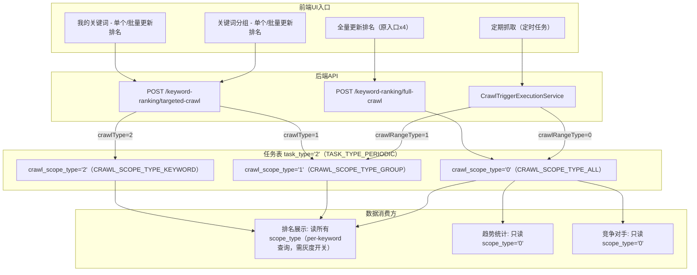

# SEO关键词排名抓取支持指定分组/关键词进行抓取 - 开发计划（规范优化版）

> **与原版差异说明**：本版本依据项目后端开发规范（`backend-coding-standards`）和AGENTS.md约定，在原版基础上补充了以下优化项（标注 `[规范]` 的为新增/修正内容）：
> 1. 新增「常量定义」专章（禁止魔法字符串）
> 2. Service 方法命名修正（`insert` 前缀规范）
> 3. 事务注解补充
> 4. 空指针防护强化
> 5. JSON 工具规范
> 6. `batchInsertByCollectIds` 空列表保护
> 7. 灰度开关要求（TaskInfo_Join 改造）
> 8. Job 日志级别规范
> 9. 分布式互斥锁补充
> 10. Controller 接口路径规范：入口路径写类注解，方法注解仅写 1-2 层

---

## 需求概述

在现有全量抓取基础上，新增"指定关键词"和"指定分组"两种抓取维度，包含三大功能模块：
1. "我的关键词"和"关键词分组"列表增加"更新排名"操作
2. "排名查询记录"列表增加"范围"列
3. "抓取设置"支持指定分组定期抓取

---

## 核心架构决策：task_type 策略

**采用混合方案：`task_type='2'` 不变 + 新增 `crawl_scope_type` 字段区分范围**

| 维度 | 含义 | 取值 |
|------|------|------|
| `task_type` | 任务触发方式（不变） | `'1'`=手动查询, `'2'`=系统排名抓取 |
| `crawl_scope_type` (新增) | 任务抓取范围 | `'0'`=全部, `'1'`=指定分组, `'2'`=指定关键词 |

**决策理由**：同原版，此处不再重复。

---

## 零、[规范] 常量定义（必须最先完成）

> **强制**：所有 `crawl_scope_type` / `crawl_range_type` 取值均为业务魔法值，必须定义为常量后才能在代码中引用。

### 0.1 新增位置

**文件**: `backend/common/src/main/java/com/leadong/constants/AiMonitorConstants.java`

在现有「任务类型常量（task_type）」区域（第438行）之后追加新区域：

```java
// ========================================
// 抓取范围类型常量（crawl_scope_type - keyword_search_task 表）
// ========================================

/**
 * 抓取范围类型：全量抓取（所有关键词）
 */
public static final String CRAWL_SCOPE_TYPE_ALL = "0";

/**
 * 抓取范围类型：指定分组抓取
 */
public static final String CRAWL_SCOPE_TYPE_GROUP = "1";

/**
 * 抓取范围类型：指定关键词抓取
 */
public static final String CRAWL_SCOPE_TYPE_KEYWORD = "2";

// ========================================
// 定期抓取范围类型常量（crawl_range_type - site_crawl_config 表）
// ========================================

/**
 * 定期抓取范围类型：全量（所有关键词）
 */
public static final String CRAWL_RANGE_TYPE_ALL = "0";

/**
 * 定期抓取范围类型：指定分组
 */
public static final String CRAWL_RANGE_TYPE_GROUP = "1";
```

### 0.2 引用规范

后续所有代码中：
- ✅ 使用 `AiMonitorConstants.CRAWL_SCOPE_TYPE_ALL`（值为 `"0"`）
- ✅ 使用 `AiMonitorConstants.CRAWL_SCOPE_TYPE_GROUP`（值为 `"1"`）
- ✅ 使用 `AiMonitorConstants.CRAWL_SCOPE_TYPE_KEYWORD`（值为 `"2"`）
- ✅ 使用 `AiMonitorConstants.CRAWL_RANGE_TYPE_ALL`（值为 `"0"`）
- ✅ 使用 `AiMonitorConstants.CRAWL_RANGE_TYPE_GROUP`（值为 `"1"`）
- ✅ 使用 `AiMonitorConstants.TASK_TYPE_PERIODIC`（已存在，直接复用）
- ❌ 禁止出现 `"all"`, `"group"`, `"keyword"`, `"0"`, `"1"`, `"2"` 等魔法字符串

---

## 一、数据库变更

### 1.1 `phoenix_geo_keyword_search_task` 表新增字段

```sql
ALTER TABLE phoenix_geo_keyword_search_task
  ADD COLUMN crawl_scope_type VARCHAR(2) DEFAULT '0' COMMENT '抓取范围类型: 0-全部, 1-指定分组, 2-指定关键词',
  ADD COLUMN crawl_scope_detail VARCHAR(3000) COMMENT '抓取范围详情(JSON): crawl_scope_type=1时存储分组ID数组';
```

- `crawl_scope_type`：标识任务抓取范围类型，DEFAULT `'0'` 保证老数据兼容
- `crawl_scope_detail`：仅 `crawl_scope_type='1'`（指定分组）时存储 JSON 格式分组 ID 数组；前端展示 tooltip 时根据 ID 实时查询当前分组名称；`'2'`（指定关键词）时无需存储

### 1.2 `phoenix_geo_site_crawl_config` 表新增字段

```sql
ALTER TABLE phoenix_geo_site_crawl_config
  ADD COLUMN crawl_range_type VARCHAR(2) DEFAULT '0' COMMENT '定期抓取范围类型: 0-全部, 1-指定分组',
  ADD COLUMN crawl_range_group_ids VARCHAR(3000) COMMENT '指定分组ID列表(JSON数组)';
```

### 1.3 老数据处理

- 所有现存任务记录的 `crawl_scope_type` 默认为 `'0'`（DDL DEFAULT 值自动覆盖），无需跑迁移脚本

---

## 二、后端改造

### 2.1 Entity/DTO 变更

**文件**: `backend/common/src/main/java/com/leadong/entity/KeywordSearchTask.java`
```java
/**
 * 抓取范围类型: 0-全部, 1-指定分组, 2-指定关键词
 */
private String crawlScopeType;

/**
 * 抓取范围详情(JSON): crawl_scope_type='1'时存储分组ID数组
 */
private String crawlScopeDetail;
```

**文件**: `backend/common/src/main/java/com/leadong/dto/KeywordRankingTaskDTO.java`

```java
/**
 * 抓取范围类型: 0-全部, 1-指定分组, 2-指定关键词
 * [核查] 此字段直接关联排名查询记录列表"范围"列展示，缺少则前端范围列始终为空
 */
private String crawlScopeType;

/**
 * 抓取范围详情(JSON): crawl_scope_type='1'时存储分组ID数组
 */
private String crawlScopeDetail;
```

> ⚠️ **[核查修正] 原子部署强制约束**：Entity 新增字段（`crawlScopeType`/`crawlScopeDetail`）的代码上线，**必须与 `backend-crawl-scope-mark`（§2.4.4）同一次部署**，不可分批。
>
> 原因：MyBatis Plus 的 `insert(entity)` 是全字段 INSERT（非 selective），Entity 加字段后若未同步给 `createFullCrawlTask/createFullCrawlTasks` 中的 Builder 赋值 `CRAWL_SCOPE_TYPE_ALL`，则 `crawl_scope_type` 将写入 `NULL`（覆盖 DDL DEFAULT）。后续统计 SQL 若加了 `= '0'` 过滤，NULL 值的全量任务将被误排除，导致统计数据清零。
>
> **部署检查清单**（上线前必须确认）：
> - [ ] Entity 加字段
> - [ ] `createFullCrawlTask` Builder 加 `.crawlScopeType(AiMonitorConstants.CRAWL_SCOPE_TYPE_ALL)`
> - [ ] `createFullCrawlTasks` Builder 加 `.crawlScopeType(AiMonitorConstants.CRAWL_SCOPE_TYPE_ALL)`
> - [ ] 统计 SQL 过滤条件用 `IS NULL OR = '0'`（见 §2.5）

**文件**: `backend/common/src/main/java/com/leadong/entity/SiteCrawlConfig.java`
```java
/**
 * 定期抓取范围类型: 0-全部, 1-指定分组
 */
private String crawlRangeType;

/**
 * 指定分组ID列表(JSON数组格式存储)
 */
private String crawlRangeGroupIds;
```

**文件**: `backend/api/src/main/java/com/leadong/dto/SiteCrawlConfigDTO.java`
```java
/**
 * 定期抓取范围类型
 */
private String crawlRangeType;

/**
 * 指定分组ID列表（前端传List，Entity层转JSON存储）
 */
private List<Long> crawlRangeGroupIds;
```

### 2.2 新增请求 DTO

新建 `TargetedCrawlRequest.java`：

```java
@Data
public class TargetedCrawlRequest {
    @NotNull
    private Long siteId;

    @NotEmpty
    private List<SearchEngineDTO> searchEngines;

    /**
     * 抓取类型: "1"=指定分组, "2"=指定关键词
     * [规范] 取值必须与 AiMonitorConstants.CRAWL_SCOPE_TYPE_GROUP/KEYWORD 对应
     */
    @NotBlank
    private String crawlType;

    /**
     * crawlType="2"（指定关键词）时必填（collect_id 列表）
     * [规范] 不加 @NotEmpty，因为 crawlType="1"（分组）时合法为空；
     *        条件校验在 Service 层 insertTargetedCrawlTasks 内执行
     */
    private List<Long> collectIds;

    /**
     * crawlType="1"（指定分组）时必填
     * [规范] 同上，条件校验在 Service 层执行
     */
    private List<Long> groupIds;
}
```

> **[规范] 说明**：`@NotEmpty` 不适合用于互斥条件字段（`crawlType="2"` 时 `groupIds` 为空是合法的，反之亦然）。统一在 Service 层做业务校验，避免 DTO 层注解语义误导。

### 2.3 Controller 新增接口

**[规范] 接口路径规范**：业务段定义在类级 `@RequestMapping`（对齐项目现有 Controller 惯例，如 `/keyword-ranking`、`/keyword-group`），方法注解只写 1-2 层路径段（对齐现有方法如 `/capture`、`/history`）。

**文件**: `backend/api/src/main/java/com/leadong/controller/KeywordRankingController.java`

> 类上已有 `@RequestMapping("/keyword-ranking")`，在类内追加：

```java
/**
 * 指定关键词/分组抓取
 * [规范] 方法名与 Service 层 insertTargetedCrawlTasks 对应，动词语义一致
 * [核查修正] 项目 Controller 统一使用 com.leadong.common.Result<T>，禁止用 R<T>
 * [核查修正] 关键词排名模块不使用 @GeoOperationPermission（仅 GEO AI 监控模块使用）
 * [规范] 接口内部不向外 throw，所有异常在 catch 内打日志后 return
 */
@PostMapping("/targeted-crawl")
@RequireFeature(value = FeatureCodeEnum.KEYWORD_RANK, message = "未开通关键词排名抓取功能权限")
public Result<Map<String, Object>> targetedCrawl(@RequestBody @Validated TargetedCrawlRequest request) {
    Long organizationId = RequestContext.getOrganizationId();
    if (organizationId == null) {
        return Result.error("用户未登录");
    }
    RequestContext.UserInfo userInfo = RequestContext.getUserInfo();
    Long userId = userInfo != null ? userInfo.getId() : null;
    String userName = userInfo != null ? userInfo.getName() : null;
    try {
        keywordRankingService.insertTargetedCrawlTasks(organizationId, request, userId, userName);
        return Result.success(null);
    } catch (RuntimeException e) {
        // 业务校验失败（如：collectIds为空、分组无关键词、点数不足、任务互斥）
        log.warn("指定抓取任务创建失败[业务]: organizationId={}, siteId={}, msg={}",
                organizationId, request.getSiteId(), e.getMessage());
        return Result.error(e.getMessage());
    } catch (Exception e) {
        // 系统级异常（DB、Redis、序列化等）
        log.error("指定抓取任务创建失败[系统]: organizationId={}, siteId={}",
                organizationId, request.getSiteId(), e);
        return Result.error("操作失败，请稍后重试");
    }
}
```

**文件**: `backend/api/src/main/java/com/leadong/controller/KeywordGroupController.java`

> 类上已有 `@RequestMapping("/keyword-group")`，在类内追加：

```java
/**
 * 按多分组查询去重关键词数量
 * [规范] groupIds 用 @RequestParam List<Long> 接收逗号分隔参数
 * [核查修正] 返回类型使用 Result<Map<String, Object>>，与项目现有 Controller 保持一致
 * [规范] 接口内部不向外 throw，异常在 catch 内打日志后 return
 */
@GetMapping("/keyword-count-by-groups")
public Result<Map<String, Object>> getKeywordCountByGroups(
        @RequestParam Long siteId,
        @RequestParam List<Long> groupIds) {
    try {
        int count = keywordGroupService.countDistinctKeywordsByGroups(siteId, groupIds);
        Map<String, Object> data = new HashMap<>(2);
        data.put("keywordCount", count);
        return Result.success(data);
    } catch (RuntimeException e) {
        log.warn("查询分组关键词数量失败[业务]: siteId={}, groupIds={}, msg={}", siteId, groupIds, e.getMessage());
        return Result.error(e.getMessage());
    } catch (Exception e) {
        log.error("查询分组关键词数量失败[系统]: siteId={}, groupIds={}", siteId, groupIds, e);
        return Result.error("查询失败，请稍后重试");
    }
}
```

> **[规范] 注意**：Spring MVC 的 `@RequestParam List<Long> groupIds` 可自动解析 `?groupIds=1,2,3` 格式，前端传参方式不变。前端 axios 调用路径与现有接口保持一致，使用 `/keyword-group/keyword-count-by-groups`。

### 2.4 Service 层改造

**文件**: `backend/common/src/main/java/com/leadong/service/impl/KeywordRankingServiceImpl.java`

#### 2.4.1 [规范] 方法命名修正

**原版名称**: `createTargetedCrawlTasks`
**[规范] 修正为**: `insertTargetedCrawlTasks`

> 依据 AGENTS.md 规范：**包含 INSERT 的写方法必须以 `insert` 前缀开头**。该方法内部执行 INSERT `keyword_search_task` + INSERT `keyword_search_task_info` + UPDATE 点数扣减，使用 `insert` 前缀准确表达写操作语义。

#### 2.4.2 完整逻辑流程（对标现有 `createFullCrawlTask` 约第2880-2978行）

```java
/**
 * 指定关键词/分组抓取（创建任务并扣减点数）
 *
 * [规范] @Transactional：内含多步写操作（insert task + insert task_info + 点数扣减），必须保证原子性
 * [规范] 方法命名使用 insert 前缀（含 INSERT 操作）
 */
@Transactional(rollbackFor = Exception.class)
public void insertTargetedCrawlTasks(Long organizationId,
                                     TargetedCrawlRequest request,
                                     String userId,
                                     String userName) {
    // Step 1: 参数校验（Service 层条件校验，校验失败打 warn 日志后 throw 触发事务回滚）
    if (AiMonitorConstants.CRAWL_SCOPE_TYPE_KEYWORD.equals(request.getCrawlType())) {
        if (CollectionUtil.isEmpty(request.getCollectIds())) {
            log.warn("指定关键词抓取参数非法: collectIds为空, organizationId={}, siteId={}",
                    organizationId, request.getSiteId());
            throw new BusinessException("指定关键词抓取时，collectIds 不能为空");
        }
    } else if (AiMonitorConstants.CRAWL_SCOPE_TYPE_GROUP.equals(request.getCrawlType())) {
        if (CollectionUtil.isEmpty(request.getGroupIds())) {
            log.warn("指定分组抓取参数非法: groupIds为空, organizationId={}, siteId={}",
                    organizationId, request.getSiteId());
            throw new BusinessException("指定分组抓取时，groupIds 不能为空");
        }
    } else {
        log.warn("crawlType取值无效: crawlType={}, organizationId={}, siteId={}",
                request.getCrawlType(), organizationId, request.getSiteId());
        throw new BusinessException("crawlType 取值无效，合法值为 1(分组) 或 2(关键词)");
    }

    // Step 2: 获取网站抓取配置（检索深度 retrievalDepth）
    SiteCrawlConfig config = siteCrawlConfigService.getByOrgAndSite(organizationId, request.getSiteId());
    if (ObjectUtil.isEmpty(config)) {
        log.warn("未找到网站抓取配置: organizationId={}, siteId={}", organizationId, request.getSiteId());
        throw new BusinessException("未找到网站抓取配置");
    }

    // Step 3: 解析关键词 collectId 列表（去重）
    List<Long> collectIds;
    String crawlScopeDetail = null;

    if (AiMonitorConstants.CRAWL_SCOPE_TYPE_GROUP.equals(request.getCrawlType())) {
        // 查分组下关键词
        List<KeywordGroupRelation> relations = keywordGroupRelationMapper
                .selectByGroupIds(organizationId, request.getSiteId(), request.getGroupIds());
        if (CollectionUtil.isEmpty(relations)) {
            log.warn("所选分组下无关键词: organizationId={}, siteId={}, groupIds={}",
                    organizationId, request.getSiteId(), request.getGroupIds());
            throw new BusinessException("所选分组下无关键词");
        }
        // 按 collectId 去重
        collectIds = relations.stream()
                .map(KeywordGroupRelation::getCollectId)
                .distinct()
                .collect(Collectors.toList());

        // [规范] 存储分组 ID 数组（非名称快照），前端展示时实时查询分组名称
        // [规范] JSON 序列化使用 FastJSON，禁止 net.sf.json.JSONObject
        crawlScopeDetail = JSON.toJSONString(request.getGroupIds());

    } else {
        collectIds = request.getCollectIds().stream().distinct().collect(Collectors.toList());
        // crawlType="2"（指定关键词）时 crawlScopeDetail 不存储
    }

    int keywordCount = collectIds.size();

    // Step 4: 点数验证
    int requiredPoints = keywordCount * config.getRetrievalDepth() * request.getSearchEngines().size();
    if (!exploreQuotaService.hasEnoughResource(organizationId, requiredPoints)) {
        log.warn("点数不足无法发起抓取: organizationId={}, siteId={}, requiredPoints={}",
                organizationId, request.getSiteId(), requiredPoints);
        throw new BusinessException("点数不足，无法发起抓取");
    }

    // Step 5 & 6: 任务互斥检查 + 分布式锁（见2.9节）
    for (SearchEngineDTO engine : request.getSearchEngines()) {
        String lockKey = buildCrawlMutexLockKey(organizationId, request.getSiteId(), engine.getEngineId());
        // 获取 Redis 分布式锁（详见2.9节），锁内执行互斥检查 + 创建任务
        doInsertSingleEngineCrawlTask(organizationId, request.getSiteId(), engine,
                collectIds, config, crawlScopeDetail, request.getCrawlType(), userId, userName);
    }

    // Step 7: 预扣点数（各引擎任务均创建成功后统一扣减）
    exploreQuotaService.decreaseResource(organizationId, requiredPoints);
}
```

#### 2.4.3 单引擎任务创建逻辑（抽出以便加锁）

```java
private void doInsertSingleEngineCrawlTask(...) {
    // 互斥检查
    KeywordSearchTask existingTask = keywordSearchTaskMapper
            .selectRunningOrPendingTask(organizationId, siteId, engine.getEngineId());
    if (ObjectUtil.isNotEmpty(existingTask)) {
        log.warn("任务互斥冲突: organizationId={}, siteId={}, engineId={}, existingTaskId={}",
                organizationId, siteId, engine.getEngineId(), existingTask.getId());
        throw new BusinessException("同一引擎下已有进行中的抓取任务");
    }

    // 创建任务记录
    KeywordSearchTask task = KeywordSearchTask.builder()
            .organizationId(organizationId)
            .siteId(siteId)
            .taskType(AiMonitorConstants.TASK_TYPE_PERIODIC)        // [规范] 使用常量
            .crawlScopeType(crawlType)                               // "1"=分组 或 "2"=关键词
            .crawlScopeDetail(crawlScopeDetail)
            .status(AiMonitorConstants.TASK_STATUS_PENDING)          // [规范] 使用常量
            .keywordCount(collectIds.size())
            .searchEngineSnapshot(JSON.toJSONString(engine))         // [规范] FastJSON
            .enginesId(engine.getEngineId())
            .adderNo(userId)
            .adderName(userName)
            .addTime(LocalDateTime.now())
            .updateTime(LocalDateTime.now())
            .build();
    // [规范] 禁止 MyBatis Plus 内置 insert()，使用 XML Mapper 自定义方法
    keywordSearchTaskMapper.insertKeywordSearchTask(task);

    // [规范] 调用 batchInsertByCollectIds 前必须判空（防空列表SQL语法错误）
    if (CollectionUtil.isNotEmpty(collectIds)) {
        keywordSearchTaskInfoMapper.batchInsertByCollectIds(
                organizationId, siteId, task.getTaskId(), collectIds);
    }
}
```

#### 2.4.4 修改现有全量抓取方法（补充 crawlScopeType 赋值）

```java
// createFullCrawlTask（约第2946行任务创建处）追加：
.crawlScopeType(AiMonitorConstants.CRAWL_SCOPE_TYPE_ALL)  // [规范] 使用常量，值为 "0"

// createFullCrawlTasks（约第3069行任务创建处）追加：
.crawlScopeType(AiMonitorConstants.CRAWL_SCOPE_TYPE_ALL)  // [规范] 使用常量，值为 "0"
```

> **[规范] 全量抓取方法已存在的 `insert` 调用**：若现有代码使用了 MyBatis Plus 的 `insert(task)`，需同步替换为 `insertKeywordSearchTask(task)`，确保与新增路径一致。

### 2.4b 新增 Mapper 方法

#### `KeywordSearchTaskMapper.xml` 新增 `insertKeywordSearchTask`

**文件**: `backend/common/src/main/resources/mapper/ldgldb/KeywordSearchTaskMapper.xml`

新增（`useGeneratedKeys="true"` 保证插入后 taskId 回填到 Entity 对象）：

```xml
<insert id="insertKeywordSearchTask" useGeneratedKeys="true" keyProperty="taskId">
    INSERT INTO phoenix_geo_keyword_search_task
        (organization_id, site_id, task_type, crawl_scope_type, crawl_scope_detail,
         status, keyword_count, cost_points, search_engine_snapshot, engines_id,
         adder_no, adder_name, add_time, update_time)
    VALUES
        (#{organizationId}, #{siteId}, #{taskType}, #{crawlScopeType}, #{crawlScopeDetail},
         #{status}, #{keywordCount}, #{costPoints}, #{searchEngineSnapshot}, #{enginesId},
         #{adderNo}, #{adderName}, #{addTime}, #{updateTime})
</insert>
```

**文件**: `backend/common/src/main/java/com/leadong/mapper/ldgldb/KeywordSearchTaskMapper.java`

```java
/**
 * 插入关键词搜索任务记录，taskId 通过 useGeneratedKeys 回填
 */
int insertKeywordSearchTask(KeywordSearchTask task);
```

#### `KeywordSearchTaskInfoMapper.xml` 新增 `batchInsertByCollectIds`

**文件**: `backend/common/src/main/resources/mapper/ldgldb/KeywordSearchTaskInfoMapper.xml`

在现有 `batchInsertBySelect`（第676行）之后新增：

```xml
<insert id="batchInsertByCollectIds">
    INSERT INTO phoenix_geo_keyword_search_task_info
        (organization_id, site_id, task_id, keyword_id, serp_id,
         rank_position, search_status, add_time, update_time)
    SELECT
        #{organizationId}, #{siteId}, #{taskId}, keyword_id, NULL,
        -1, '0', NOW(), NOW()
    FROM phoenix_geo_keyword_collect
    WHERE organization_id = #{organizationId}
      AND site_id = #{siteId}
      AND collect_id IN
    <foreach collection="collectIds" item="cId" open="(" separator="," close=")">
        #{cId}
    </foreach>
</insert>
```

> **[规范] 调用保护**：Service 层必须在调用此方法前执行 `CollectionUtil.isEmpty(collectIds)` 校验。若 `collectIds` 为空，`<foreach>` 会生成语法非法的 `IN ()` 导致 SQL 报错。在 Service 层拦截比在 XML 中加 `<if>` 更符合职责边界。

**文件**: `backend/common/src/main/java/com/leadong/mapper/ldgldb/KeywordSearchTaskInfoMapper.java`

```java
int batchInsertByCollectIds(@Param("organizationId") Long organizationId,
                            @Param("siteId") Long siteId,
                            @Param("taskId") Long taskId,
                            @Param("collectIds") List<Long> collectIds);
```

### 2.5 统计 SQL 兼容性修复

指定抓取只抓取部分关键词，不应参与以"任务维度"聚合的统计。需在以下位置追加条件，**使用常量参数传入**（禁止硬编码 `'0'`）：

**SQL 条件追加方式**：

```xml
AND (t.crawl_scope_type IS NULL OR t.crawl_scope_type = #{crawlScopeTypeAll})
```

对应 Mapper Java 方法增加参数 `@Param("crawlScopeTypeAll") String crawlScopeTypeAll`，调用处传入 `AiMonitorConstants.CRAWL_SCOPE_TYPE_ALL`（值为 `"0"`）。

> ⚠️ **[核查修正] 必须使用 `IS NULL OR` 双条件**，不可只写 `= #{crawlScopeTypeAll}`。
>
> 原因：若 Entity 字段上线与 `crawl-scope-mark` 步骤未能完全原子同步（如分批灰度），或部分老数据通过 `taskMapper.insert(task)` 写入时 `crawlScopeType` 未赋值，则 `crawl_scope_type` 实际存储为 `NULL`。此时仅用 `= '0'` 过滤会将这些合法全量任务全部排除，造成统计数据清零、排名列表为空的线上事故。IS NULL 兜底是防止分步部署期间出现数据断层的最后一道保护。

**需修改的 SQL 位置**（共11处）：

**`KeywordSearchTaskInfoMapper.xml`**（6处）：
- 第158行 `selectGroupTrendStatistics`
- 第182行 `selectAllFavoritedKeywordsTrendStatistics`（第205行 `AND t.task_type = '2'` 处追加）
- 第222行 `selectGroupLastTwoTrendDataPoints`（第290行处追加）
- 第455行 `selectLatestTaskForStatistics`（第463行处追加）
- 第473行 `selectTasksForStatistics`（第481行处追加）
- 第517行 `selectPreviousTaskForComparison`

**`KeywordSearchTaskMapper.xml`**（5处）：
- 第58行 `selectCompletedFullCrawlTasks`
- 第77行 `selectCompletedFullCrawlTasksForCompetitor`
- 第94行 `selectLatestFullCrawlTaskId`
- 第106行 `selectFullCrawlTaskIdsByDateRange`
- 第122行 `selectRecentFullCrawlTaskIds`（**分组列表统计核心依赖**，漏改会导致整条分组统计链路失真）

**`CompetitorStatisticsService.java`**（第65-66行）：
- 增加判断，仅全量任务参与竞争对手统计：
  ```java
  // [核查修正] crawlScopeType 可能为 null（分步部署期间的全量任务），需同时兼容 null 和 '0'
  String scopeType = task.getCrawlScopeType();
  if (scopeType != null && !AiMonitorConstants.CRAWL_SCOPE_TYPE_ALL.equals(scopeType)) {
      return; // 非全量任务跳过统计
  }
  // scopeType == null 视为全量，继续执行
  ```

**依赖链说明**（开发时必须按依赖顺序验证）：
```
selectRecentFullCrawlTaskIds → currentTaskId
  → KeywordGroupServiceImpl.toDTO() 用 currentTaskId 查分组排名统计
  → selectGroupTrendDataByTaskIds (第317行) 做排名变化对比
```

### 2.6 排名展示逻辑修复（致命问题）+ [规范] 灰度开关

**问题**：`KeywordCollectMapper.xml` 中的 `TaskInfo_Join` SQL 片段（第72-95行）是 **site-level** 子查询，指定抓取后会导致大部分关键词排名显示为 NULL。

**[规范] 灰度开关要求**（规范条款6.1.1 - 重大重构必须增加功能开关）：

`TaskInfo_Join` 的修改影响"我的关键词"列表主查询 `selectPageWithAdsData`，是生产核心 SQL，属于**高风险变更**。必须增加 Nacos 动态配置开关，异常时可快速回滚。

**实现方案**：

1. Nacos 配置项：`phoenix.geo.keyword.per_keyword_task_lookup=true`（默认 false，上线后灰度开启）
2. 通过 `@Value` 或 `NacosConfigService` 读取配置
3. Service 层根据开关决定使用新/老 SQL（或在 Mapper XML 中用 `<choose>` 区分）

**修复后的 SQL**（per-keyword 级别）：

```xml
<sql id="TaskInfo_Join">
    LEFT JOIN phoenix_geo_keyword_search_task_info task_info
      ON kc.keyword_id = task_info.keyword_id
     AND kc.organization_id = task_info.organization_id
     AND kc.site_id = task_info.site_id
     AND task_info.task_id = (
        SELECT t.task_id
        FROM phoenix_geo_keyword_search_task t
        INNER JOIN phoenix_geo_keyword_search_task_info ti
            ON t.task_id = ti.task_id
           AND ti.keyword_id = kc.keyword_id
           AND ti.organization_id = kc.organization_id
           AND ti.site_id = kc.site_id
        WHERE t.organization_id = #{organizationId}
          AND t.site_id = #{siteId}
          AND t.task_type = '2'
          AND t.status = '2'
          AND (t.crawl_scope_type IS NULL OR t.crawl_scope_type = '0')
          <if test="enginesId != null">
          AND t.engines_id = #{enginesId}
          </if>
        ORDER BY t.end_time DESC, t.add_time DESC
        LIMIT 1
     )
    <!-- latest_task JOIN（第96-114行）已是 per-keyword 级别，无需修改 -->
    ...
</sql>
```

> ⚠️ **[核查修正] `crawl_scope_type` 过滤必须写 `IS NULL OR = '0'`**，不可只写 `= '0'`。
>
> 原因与 §2.5 相同：分步部署期间存在全量任务 `crawl_scope_type=NULL` 的时间窗口，只用 `= '0'` 会将其排除，导致所有关键词的排名显示为空。IS NULL 是防断层的保底条件。
>
> **注意**：`TaskInfo_Join` 中第96-114行的 `latest_task` JOIN（用于展示"最近排名日期"）已是 per-keyword 级别，对应子查询**也需要同步加** `AND (t.crawl_scope_type IS NULL OR t.crawl_scope_type = '0')` 过滤，否则"最近排名日期"可能指向一次指定抓取任务。

**性能评估**：per-keyword 子查询在有 `(task_type, status, organization_id, site_id, end_time)` 索引时性能可接受，且 `selectPageForComparison` 已使用相同模式在生产运行。

### 2.7 定期抓取改造

**文件**: `backend/tasks/src/main/java/com/leadong/service/CrawlTriggerExecutionService.java`

修改 `executeTrigger` 方法（约第68-197行），在步骤4（检查关键词）之前插入 `crawlRangeType` 判断逻辑：

```java
String crawlRangeType = ObjectUtil.defaultIfNull(config.getCrawlRangeType(),
        AiMonitorConstants.CRAWL_RANGE_TYPE_ALL);  // [规范] 使用常量，值为 "0"

if (AiMonitorConstants.CRAWL_RANGE_TYPE_GROUP.equals(crawlRangeType)) {
    // 解析分组ID（注意JSON解析判空）
    String rawGroupIds = config.getCrawlRangeGroupIds();
    if (StrUtil.isBlank(rawGroupIds)) {
        log.warn("crawlRangeType=1 但 crawlRangeGroupIds 为空，siteId={}, 跳过定期抓取", siteId);
        return;
    }
    List<Long> groupIds;
    try {
        // [规范] 使用 FastJSON，禁止 net.sf.json.JSONObject
        groupIds = JSON.parseArray(rawGroupIds, Long.class);
    } catch (Exception e) {
        log.warn("crawlRangeGroupIds JSON 解析失败，siteId={}, raw={}", siteId, rawGroupIds, e);
        return;
    }
    if (CollectionUtil.isEmpty(groupIds)) {
        log.warn("crawlRangeGroupIds 解析结果为空，siteId={}, 跳过定期抓取", siteId);
        return;
    }

    // 过滤已删除分组
    groupIds = filterValidGroupIds(organizationId, groupIds);
    if (CollectionUtil.isEmpty(groupIds)) {
        log.warn("有效分组为空（分组均已被删除），siteId={}, 跳过定期抓取", siteId);
        return;
    }

    // 构造指定分组抓取请求，复用 insertTargetedCrawlTasks
    TargetedCrawlRequest req = new TargetedCrawlRequest();
    req.setSiteId(siteId);
    req.setCrawlType(AiMonitorConstants.CRAWL_SCOPE_TYPE_GROUP);  // [规范] 常量，值为 "1"
    req.setGroupIds(groupIds);
    req.setSearchEngines(buildEnginesFromConfig(config));
    keywordRankingService.insertTargetedCrawlTasks(organizationId, req, SYSTEM_USER_ID, SYSTEM_USER_NAME);

} else {
    // 原有全量抓取逻辑保持不变（crawlRangeType="0"）
    // ...
}
```

> **[规范] Job 日志级别规范**（规范条款3.2.1）：`CrawlTriggerExecutionService` 是定时任务服务，**禁止使用 `log.info()`**。
> - 正常流程使用 `log.debug()`
> - 业务异常/跳过使用 `log.warn()`
> - 系统错误使用 `log.error()`

### 2.8 分组删除联动清理

**文件**: `backend/api/src/main/java/com/leadong/service/impl/KeywordGroupServiceImpl.java`

**[规范] 方法命名**：现有方法为 `delete()`，含写操作，改为 `deleteGroup()` 或确认原方法命名（如已存在则不改，仅在内部补充逻辑即可）。联动写操作必须加 `@Transactional`。

在 `delete()` 方法（约第606-634行）末尾追加：

```java
// 联动清理 crawl_range_group_ids
List<SiteCrawlConfig> siteConfigs = siteCrawlConfigMapper
        .selectByOrgAndSite(organizationId, siteId);

for (SiteCrawlConfig cfg : siteConfigs) {
    if (StrUtil.isBlank(cfg.getCrawlRangeGroupIds())) {
        continue;
    }
    List<Long> currentGroupIds;
    try {
        // [规范] FastJSON 解析，try-catch 防止 JSON 格式损坏
        currentGroupIds = JSON.parseArray(cfg.getCrawlRangeGroupIds(), Long.class);
    } catch (Exception e) {
        log.warn("crawlRangeGroupIds 解析失败，configId={}", cfg.getConfigId(), e);
        continue;
    }
    if (CollectionUtil.isEmpty(currentGroupIds) || !currentGroupIds.contains(deletedGroupId)) {
        continue;
    }
    currentGroupIds.remove(deletedGroupId);
    String newCrawlRangeType;
    String newCrawlRangeGroupIds;
    if (currentGroupIds.isEmpty()) {
        newCrawlRangeType = AiMonitorConstants.CRAWL_RANGE_TYPE_ALL;  // [规范] 使用常量，值为 "0"
        newCrawlRangeGroupIds = null;
    } else {
        newCrawlRangeType = AiMonitorConstants.CRAWL_RANGE_TYPE_GROUP;  // [规范] 值为 "1"
        newCrawlRangeGroupIds = JSON.toJSONString(currentGroupIds);
    }
    // [规范] 禁止 MyBatis Plus 内置 updateById()，使用 XML Mapper 自定义方法
    siteCrawlConfigMapper.updateCrawlRangeById(
            cfg.getConfigId(), newCrawlRangeType, newCrawlRangeGroupIds, LocalDateTime.now());
}
```

**新增 Mapper 方法**（`SiteCrawlConfigMapper.xml`）：

```xml
<update id="updateCrawlRangeById">
    UPDATE phoenix_geo_site_crawl_config
    SET crawl_range_type      = #{crawlRangeType},
        crawl_range_group_ids = #{crawlRangeGroupIds},
        update_time           = #{updateTime}
    WHERE config_id = #{configId}
</update>
```

**文件**: `backend/common/src/main/java/com/leadong/mapper/ldgldb/SiteCrawlConfigMapper.java`

```java
int updateCrawlRangeById(@Param("configId") Long configId,
                         @Param("crawlRangeType") String crawlRangeType,
                         @Param("crawlRangeGroupIds") String crawlRangeGroupIds,
                         @Param("updateTime") LocalDateTime updateTime);
```

### 2.9 任务并发互斥策略（[规范] 补充分布式锁）

**现有机制**：`selectRunningOrPendingTask` 做 DB 级查询互斥，但存在并发竞争窗口（两个请求同时通过 DB 查询，双重创建任务）。

**[规范] 补充 Redis 分布式锁**（对齐现有全量抓取的实现模式，参考 `Constants.REDIS_LOCK_PREFIX_SERP_TASK`）：

```java
private static final String CRAWL_TASK_CREATE_LOCK_KEY = "kw:crawl:create:{orgId}:{siteId}:{engineId}";

// Service 层 doInsertSingleEngineCrawlTask 内：
String lockKey = String.format("kw:crawl:create:%d:%d:%d",
        organizationId, siteId, engine.getEngineId());
boolean locked = redisLockService.tryLock(lockKey, 10);  // 10s 超时
if (!locked) {
    log.warn("获取抓取任务创建锁失败[频繁操作]: organizationId={}, siteId={}, engineId={}",
            organizationId, siteId, engine.getEngineId());
    throw new BusinessException("操作过于频繁，请稍后重试");
}
try {
    // 互斥检查 + 创建任务
    KeywordSearchTask existing = keywordSearchTaskMapper
            .selectRunningOrPendingTask(organizationId, siteId, engine.getEngineId());
    if (ObjectUtil.isNotEmpty(existing)) {
        log.warn("任务互斥拒绝: organizationId={}, siteId={}, engineId={}, existingTaskId={}",
                organizationId, siteId, engine.getEngineId(), existing.getId());
        throw new BusinessException("同引擎下已有进行中的抓取任务，请等待完成后重试");
    }
    // ... 创建任务逻辑
} finally {
    redisLockService.unlock(lockKey);
}
```

**互斥规则总览**（不变，通过 `task_type='2'` 自然兼容）：

| 场景 | 结果 |
|------|------|
| 全量抓取进行中 → 同引擎指定抓取 | 被拦截（合理） |
| 指定抓取进行中 → 同引擎全量抓取 | 被拦截（合理） |
| 指定抓取进行中 → 同引擎另一指定抓取 | 被拦截（合理） |
| 不同搜索引擎的任务 | 互不影响（合理） |

### 2.10 保存抓取设置时空分组校验

**前端校验**：在 `useCrawlSettings.ts` 的 `saveCrawlConfig` 方法中：
```typescript
if (crawlRangeType.value === '1' && crawlRangeGroupIds.value.length === 0) {
  ElMessage.warning('请至少选择一个分组')
  return
}
```

**后端兜底**：在 `SiteConfigController.java`（或 Service 层）保存配置时校验：
```java
if (AiMonitorConstants.CRAWL_RANGE_TYPE_GROUP.equals(dto.getCrawlRangeType())  // [规范] 常量，值 "1"
        && CollectionUtil.isEmpty(dto.getCrawlRangeGroupIds())) {               // [规范] CollectionUtil
    return R.fail("指定分组定期抓取：请至少选择一个分组");
}
```

> **[规范] Entity → DB 存储转换**：`SiteCrawlConfigDTO.crawlRangeGroupIds`（`List<Long>`）保存前转为 `JSON.toJSONString(dto.getCrawlRangeGroupIds())` 再写入 `SiteCrawlConfig.crawlRangeGroupIds`（`String`）。读取时反向解析，解析前必须 `StrUtil.isNotBlank()` 判空。

---

## 三、前端改造

### 3.0 改动文件总览

| 文件 | 改动类型 | 对应功能 |
|------|---------|---------|
| `api/keywordRanking.ts` | 新增接口 + 类型扩展 | 指定抓取请求 |
| `api/siteConfig.ts` | 类型扩展 | 抓取设置新字段 |
| `api/keyword.ts` | 新增接口 | 分组关键词数查询 |
| `views/KeywordManagement.vue` | 工具栏 + 菜单 + 逻辑 | 更新排名操作入口 |
| `views/KeywordRankingCapture.vue` | 新增表格列 | 排名查询记录范围列 |
| `components/WebsiteSettings/CrawlSettingsPanel.vue` | 区域重构 | 定期抓取范围设置 |
| `composables/useCrawlSettings.ts` | 状态 + 方法扩展 | 抓取范围逻辑 |
| `components/UpdateWebsiteRankingDialog.vue` | prop 扩展 | 弹窗关键词数适配 |

---

### 3.1 API 层扩展

**文件**: `frontend/src/api/keywordRanking.ts`

```typescript
// 新增请求参数类型
export interface TargetedCrawlParams {
  siteId: number
  searchEngines: SearchEngineDTO[]
  crawlType: '1' | '2'      // '1'=指定分组, '2'=指定关键词
  collectIds?: number[]      // crawlType='2' 时传
  groupIds?: number[]        // crawlType='1' 时传
}

// 新增请求方法
export const createTargetedCrawlTask = (params: TargetedCrawlParams) =>
  request.post('/keyword-ranking/targeted-crawl', params)

// 扩展已有类型（在 KeywordRankingTask 接口追加）
export interface KeywordRankingTask {
  // ...原有字段保持不变
  crawlScopeType?: '0' | '1' | '2'  // 新增
  crawlScopeDetail?: string          // 新增，JSON 字符串（存分组ID数组）
}
```

**文件**: `frontend/src/api/siteConfig.ts`

```typescript
// 在 CrawlConfig 接口追加
export interface CrawlConfig {
  // ...原有字段保持不变
  crawlRangeType?: '0' | '1'    // 新增：'0'=全部, '1'=指定分组
  crawlRangeGroupIds?: number[]  // 新增
}
```

**文件**: `frontend/src/api/keyword.ts`

```typescript
// 新增：按多分组查询去重关键词数量
export const getKeywordCountByGroups = (
  siteId: number,
  groupIds: number[]
): Promise<{ code: number; data: { keywordCount: number } }> => {
  return request.get('/keyword-group/keyword-count-by-groups', {
    params: { siteId, groupIds: groupIds.join(',') }
  })
}
```

---

### 3.2 "我的关键词"列表 — 新增"更新排名"操作

**文件**: `frontend/src/views/KeywordManagement.vue`

**批量工具栏**（约第303行 `selection-toolbar` 区域，在"设置分组"按钮之前插入）：

```html
<el-button
  v-if="hasKeywordRankPermission"
  link
  type="primary"
  @click="handleBatchUpdateRanking"
>
  更新排名
</el-button>
```

**行级 more-options 菜单**（约第364行，在"关键词探索"菜单项之前插入，作为第一项）：

```html
<el-dropdown-item
  v-if="hasKeywordRankPermission"
  @click="handleSingleUpdateRanking(row)"
>
  <el-icon><Refresh /></el-icon>
  更新排名
  <el-tooltip content="更新关键词在搜索引擎的排名" placement="right">
    <el-icon class="info-icon"><InfoFilled /></el-icon>
  </el-tooltip>
</el-dropdown-item>
```

**新增逻辑方法**：

```typescript
// 单个关键词更新排名
const handleSingleUpdateRanking = (row: KeywordItem) => {
  targetKeywordCount.value = 1
  targetCollectIds.value = [row.collectId]
  targetCrawlType.value = '2'
  updateRankingDialogVisible.value = true
}

// 批量关键词更新排名
const handleBatchUpdateRanking = () => {
  targetKeywordCount.value = selectedRows.value.length
  targetCollectIds.value = selectedRows.value.map(r => r.collectId)
  targetCrawlType.value = '2'
  updateRankingDialogVisible.value = true
}

// 弹窗确认后调用（crawlType='2' 指定关键词路径）
const onUpdateRankingConfirm = async ({ selectedEngines }: { selectedEngines: SearchEngineDTO[] }) => {
  await createTargetedCrawlTask({
    siteId: currentSiteId.value,
    searchEngines: selectedEngines,
    crawlType: '2',
    collectIds: targetCollectIds.value
  })
  ElMessage.success('排名抓取任务已提交')
  updateRankingDialogVisible.value = false
}
```

**模板中弹窗绑定**（复用 `UpdateWebsiteRankingDialog`，传入 `targetKeywordCount` 跳过内部加载）：

```html
<UpdateWebsiteRankingDialog
  v-model:visible="updateRankingDialogVisible"
  :target-keyword-count="targetKeywordCount"
  @confirm="onUpdateRankingConfirm"
/>
```

---

### 3.3 "关键词分组"列表 — 新增"更新排名"操作

**文件**: `frontend/src/views/KeywordManagement.vue`（分组 tab 区域）

**批量工具栏**（约第804行，在"删除"按钮之前插入）：

```html
<el-button
  v-if="hasKeywordRankPermission"
  link
  type="primary"
  @click="handleGroupBatchUpdateRanking"
>
  更新排名
</el-button>
```

**行级 more-options 菜单**（约第872行，在"编辑"菜单项之后插入）：

```html
<el-dropdown-item @click="handleGroupUpdateRanking(row)">
  <el-icon><Refresh /></el-icon>
  更新排名
</el-dropdown-item>
```

**新增逻辑方法**：

> ⚠️ **禁止前端累加各分组 `keywordCount`**（同一关键词可属于多个分组，累加会重复计数），必须调后端去重接口。

```typescript
// 单分组更新排名
const handleGroupUpdateRanking = async (row: GroupItem) => {
  const res = await getKeywordCountByGroups(currentSiteId.value, [row.groupId])
  targetKeywordCount.value = res.data.keywordCount
  targetGroupIds.value = [row.groupId]
  targetCrawlType.value = '1'
  updateRankingDialogVisible.value = true
}

// 批量分组更新排名
const handleGroupBatchUpdateRanking = async () => {
  const groupIds = selectedGroups.value.map(g => g.groupId)
  const res = await getKeywordCountByGroups(currentSiteId.value, groupIds)
  targetKeywordCount.value = res.data.keywordCount
  targetGroupIds.value = groupIds
  targetCrawlType.value = '1'
  updateRankingDialogVisible.value = true
}

// 弹窗确认后调用（crawlType='1' 指定分组路径）
const onGroupUpdateRankingConfirm = async ({ selectedEngines }: { selectedEngines: SearchEngineDTO[] }) => {
  await createTargetedCrawlTask({
    siteId: currentSiteId.value,
    searchEngines: selectedEngines,
    crawlType: '1',
    groupIds: targetGroupIds.value
  })
  ElMessage.success('排名抓取任务已提交')
  updateRankingDialogVisible.value = false
}
```

---

### 3.4 "排名查询记录"列表 — 新增"范围"列

**文件**: `frontend/src/views/KeywordRankingCapture.vue`

在"日期"列之后、"数量"列（第88行）之前插入：

```html
<el-table-column label="范围" width="120">
  <template #default="{ row }">
    <!-- 老数据兼容：crawlScopeType 为空或 '0' 均显示全部 -->
    <span v-if="!row.crawlScopeType || row.crawlScopeType === '0'">
      全部
    </span>
    <!-- 指定关键词：无 tooltip -->
    <span v-else-if="row.crawlScopeType === '2'">
      指定关键词
    </span>
    <!-- 指定分组：有 tooltip 展示分组名称列表 -->
    <template v-else-if="row.crawlScopeType === '1'">
      <el-tooltip
        :content="getGroupNamesTooltip(row)"
        placement="top"
        :show-after="300"
      >
        <span class="scope-group-text">
          指定分组
          <el-icon class="info-icon"><InfoFilled /></el-icon>
        </span>
      </el-tooltip>
    </template>
  </template>
</el-table-column>
```

**辅助方法**（`crawlScopeDetail` 存储分组 ID 数组，映射为名称展示）：

```typescript
// 分组ID → 名称映射表，列表加载后批量预取，避免逐行请求
const groupNameMap = ref<Record<number, string>>({})

// 列表加载完毕后批量预取分组名称
const preloadGroupNames = async (tasks: KeywordRankingTask[]) => {
  const allGroupIds = new Set<number>()
  tasks.forEach(task => {
    if (task.crawlScopeType === '1' && task.crawlScopeDetail) {
      try {
        const ids: number[] = JSON.parse(task.crawlScopeDetail)
        ids.forEach(id => allGroupIds.add(id))
      } catch { /* 解析失败跳过 */ }
    }
  })
  if (allGroupIds.size === 0) return
  const res = await getGroupsByIds([...allGroupIds])
  res.data.forEach((g: { groupId: number; groupName: string }) => {
    groupNameMap.value[g.groupId] = g.groupName
  })
}

// tooltip 内容生成（分组已删除时降级显示"已删除分组"）
const getGroupNamesTooltip = (row: KeywordRankingTask): string => {
  if (!row.crawlScopeDetail) return '指定分组'
  try {
    const groupIds: number[] = JSON.parse(row.crawlScopeDetail)
    const names = groupIds.map(id => groupNameMap.value[id] ?? '已删除分组')
    return names.join('、') || '指定分组'
  } catch {
    return '指定分组'
  }
}
```

---

### 3.5 抓取设置面板 — 定期抓取区域重构

**文件**: `frontend/src/components/WebsiteSettings/CrawlSettingsPanel.vue`

修改"定期抓取"区域（约第29-58行），改为**纵向层叠结构**，开关关闭时隐藏所有子项：

```html
<div class="periodic-crawl-section">
  <!-- 开关行 -->
  <div class="section-row">
    <el-switch v-model="periodicEnabled" />
    <span class="label-text">开启后，系统会按照设置频率，定期抓取目标关键词的排名数据。</span>
  </div>

  <template v-if="periodicEnabled">
    <!-- 抓取范围（新增） -->
    <div class="section-row">
      <span class="row-label">抓取范围</span>
      <el-radio-group v-model="crawlRangeType" @change="onCrawlRangeTypeChange">
        <el-radio value="0">全部</el-radio>
        <el-radio value="1">指定分组</el-radio>
      </el-radio-group>
    </div>

    <!-- 指定分组多选 Select（crawlRangeType='1' 时展示） -->
    <div v-if="crawlRangeType === '1'" class="section-row group-select-row">
      <el-select
        v-model="crawlRangeGroupIds"
        multiple
        collapse-tags
        placeholder="请选择分组"
        @change="onGroupSelectChange"
      >
        <el-option
          v-for="group in groupOptions"
          :key="group.groupId"
          :label="group.groupName"
          :value="group.groupId"
        />
      </el-select>
    </div>

    <!-- 当前关键词数（实时刷新） -->
    <div class="section-row">
      <span class="row-label">当前关键词数：</span>
      <span class="keyword-count">{{ currentKeywordCount }}</span>
    </div>

    <!-- 抓取频率（原逻辑不变） -->
    <!-- 搜索引擎（原逻辑不变） -->
  </template>
</div>
```

**文件**: `frontend/src/composables/useCrawlSettings.ts`

```typescript
// 新增状态
const crawlRangeType = ref<'0' | '1'>('0')
const crawlRangeGroupIds = ref<number[]>([])
const currentKeywordCount = ref<number>(0)

// loadCrawlConfig 扩展（读取新字段）
const loadCrawlConfig = async (siteId: number) => {
  const res = await getCrawlConfig(siteId)
  // ...原有字段赋值不变
  crawlRangeType.value = res.data.crawlRangeType ?? '0'
  crawlRangeGroupIds.value = res.data.crawlRangeGroupIds ?? []
  await refreshKeywordCount(siteId)
}

// 切换抓取范围类型时刷新关键词数
const onCrawlRangeTypeChange = async () => {
  if (crawlRangeType.value === '0') {
    currentKeywordCount.value = totalKeywordCount.value
  } else {
    crawlRangeGroupIds.value = []
    currentKeywordCount.value = 0
  }
}

// 分组选择变化时刷新关键词数
const onGroupSelectChange = async () => {
  await refreshKeywordCount(currentSiteId.value)
}

// 关键词数刷新（全部用总数；指定分组调后端去重接口）
const refreshKeywordCount = async (siteId: number) => {
  if (crawlRangeType.value === '0') {
    currentKeywordCount.value = totalKeywordCount.value
  } else if (crawlRangeGroupIds.value.length > 0) {
    const res = await getKeywordCountByGroups(siteId, crawlRangeGroupIds.value)
    currentKeywordCount.value = res.data.keywordCount
  } else {
    currentKeywordCount.value = 0
  }
}

// saveCrawlConfig 扩展（含前端空分组校验）
const saveCrawlConfig = async () => {
  // [规范] 前端兜底校验，后端同样有校验
  if (crawlRangeType.value === '1' && crawlRangeGroupIds.value.length === 0) {
    ElMessage.warning('请至少选择一个分组')
    return
  }
  await updateCrawlConfig({
    // ...原有字段
    crawlRangeType: crawlRangeType.value,
    crawlRangeGroupIds: crawlRangeGroupIds.value
  })
}
```

---

### 3.6 更新排名弹窗适配

**文件**: `frontend/src/components/UpdateWebsiteRankingDialog.vue`

新增 `targetKeywordCount` prop，由父组件传入时跳过内部 `loadKeywordCount()` 请求：

```typescript
// 新增 prop
const props = defineProps<{
  // ...原有 props
  targetKeywordCount?: number  // 指定抓取场景由父组件传入，全量场景不传
}>()

// 弹窗打开时判断（约第433行）
const onDialogOpen = async () => {
  if (props.targetKeywordCount && props.targetKeywordCount > 0) {
    keywordCount.value = props.targetKeywordCount  // 直接使用外部传入，跳过接口请求
  } else {
    await loadKeywordCount()                        // 全量场景走原逻辑
  }
}
```

确认时 emit 仅返回 `{ selectedEngines }`，抓取类型（`crawlType` / `collectIds` / `groupIds`）由父组件持有并调用对应接口：

```typescript
const onConfirm = () => {
  emit('confirm', { selectedEngines: selectedEngines.value })
}
```

---

## 四、关键数据流



---

## 五、注意事项与边界处理

1. **[规范] 常量强制使用**：所有 `crawl_scope_type`/`crawl_range_type` 取值必须通过 `AiMonitorConstants.CRAWL_SCOPE_TYPE_*` / `CRAWL_RANGE_TYPE_*` 引用，禁止魔法字符串（包括 `"0"`, `"1"`, `"2"`）出现在代码中

1a. **[规范] 禁用 MyBatis Plus 内置 CRUD 方法**：所有 SQL 操作必须通过 XML Mapper 自定义方法执行。具体禁止：`mapper.insert(entity)`（→ `insertKeywordSearchTask(task)`）、`mapper.updateById(entity)`（→ `updateCrawlRangeById(...)`）、`LambdaQueryWrapper`/`QueryWrapper`。本方案新增的 3 个 XML 方法：`insertKeywordSearchTask`（`KeywordSearchTaskMapper.xml`）、`batchInsertByCollectIds`（`KeywordSearchTaskInfoMapper.xml`）、`updateCrawlRangeById`（`SiteCrawlConfigMapper.xml`）

2. **[规范] 方法命名**：新增的写入方法命名为 `insertTargetedCrawlTasks`（含INSERT操作，必须用 `insert` 前缀）

3. **[规范] 事务覆盖**：`insertTargetedCrawlTasks` 包含多步写操作（insert task + insert task_info + 点数扣减），必须加 `@Transactional(rollbackFor = Exception.class)`；`deleteGroup` 中的联动清理同样需要事务保护

4. **[规范] batchInsertByCollectIds 防护**：Service 层调用前必须 `CollectionUtil.isEmpty(collectIds)` 判空，`<foreach>` 空集合会产生语法非法的 `IN ()` 导致 SQL 报错

5. **[规范] JSON 工具规范**：`crawlScopeDetail`（存储分组 ID 数组）和 `crawlRangeGroupIds` 的 JSON 序列化/反序列化统一使用 FastJSON（`JSON.toJSONString()` / `JSON.parseArray()`），禁止使用 `net.sf.json.JSONObject`；反序列化必须加 `try-catch`

6. **[规范] crawlRangeGroupIds 解析必须判空**：`StrUtil.isNotBlank(rawGroupIds)` + `try-catch(FastJSON)` + `CollectionUtil.isEmpty()` 三重保护；`crawlRangeType` 读取时用 `ObjectUtil.defaultIfNull(config.getCrawlRangeType(), CRAWL_RANGE_TYPE_ALL)` 兜底

7. **[规范] 灰度开关（最高优先级）**：`TaskInfo_Join` SQL 改造影响核心排名展示，必须通过 Nacos 动态配置开关灰度上线，异常时可秒级回滚

8. **[规范] Job 日志级别**：`CrawlTriggerExecutionService` 内禁止 `log.info()`，正常流程用 `log.debug()`，业务异常用 `log.warn()`，系统错误用 `log.error()`。**核查发现**该文件现有 `log.info()` 5处（第69、85、155、187、196行），新增分组抓取逻辑时需一并修改

9. **[规范] 并发互斥加锁**：在 Redis 层加分布式锁（`kw:crawl:create:{orgId}:{siteId}:{engineId}`），防止 DB 查询互斥的并发竞争窗口导致重复任务

10. **去重逻辑**：批量提交多个分组时，Service 层通过 `stream().distinct()` 对 `collectId` 去重，同一关键词只抓取一次

11. **[规范] 致命问题最高优先级**：`TaskInfo_Join` 改造（含灰度开关配置）必须在指定抓取功能上线前完成并验证，否则指定抓取后大部分关键词排名显示为 NULL

12. **趋势/竞争对手统计隔离**：聚合统计 SQL 过滤条件必须写 `(t.crawl_scope_type IS NULL OR t.crawl_scope_type = #{crawlScopeTypeAll})`（共11处），不可只写 `= '0'`；`IS NULL` 兜底用于保护分步部署期间未赋值的全量任务不被误排除

13. **老数据兼容（核查修正）**：DDL `DEFAULT '0'` 仅对列名不在 INSERT 语句中时生效；若 MyBatis Plus `insert(entity)` 全字段 INSERT 且 `crawlScopeType` 未赋值，则实际存 `NULL`（覆盖 DEFAULT）。因此所有 SQL 过滤必须用 `IS NULL OR = '0'`，不依赖 DEFAULT 保证数据干净

14. **权限控制**：新增操作复用 `hasKeywordRankPermission` 权限判断

15. **分组删除边界**：分组被删除时联动清理 `crawl_range_group_ids`（含 `@Transactional`）；若清空后列表为空则将 `crawl_range_type` 重置为 `CRAWL_RANGE_TYPE_ALL`（`"0"`）；定期触发时过滤无效分组 ID

16. **`crawl_scope_detail` 存储策略变更**：改为存储分组 **ID** 数组（非名称快照）。前端展示 tooltip 时根据 ID 数组实时查询当前分组名称。若分组已被删除，ID 在查询时找不到对应记录，前端应做缺省处理（如显示"已删除分组"或过滤掉）；若分组被重命名，tooltip 将展示最新名称。**注意**：这与 `search_engine_snapshot` 的快照理念不同，前端需要额外处理"分组已删除"的降级场景

17. **全量入口覆盖确认**：TopHeader / 仪表盘 / 关键词管理顶部 / 定时任务（`crawlRangeType='0'`）均走 `createFullCrawlTasks`，统一设 `crawlScopeType=AiMonitorConstants.CRAWL_SCOPE_TYPE_ALL`

18. **`selectRecentFullCrawlTaskIds` 必改**：漏改此处会导致整条分组统计链路（`currentTaskId` → `toDTO()` → `selectGroupTrendDataByTaskIds`）数据全部失真，开发时须优先验证此依赖链

---

## 六、开发顺序建议

按依赖关系推荐以下开发顺序：

1. **数据库变更**（`db-migration`）
2. **常量定义**（`backend-constants`）—— 必须在所有代码开发之前完成
3. **⚠️ [核查修正] Entity/DTO 扩展 + 全量抓取 crawlScopeType 标记（原子步骤，不可分批）**（`backend-entity-dto` + `backend-crawl-scope-mark`）
   > 原因：MyBatis Plus `insert(entity)` 全字段 INSERT，Entity 加字段后若未同步给全量抓取 Builder 赋值 `CRAWL_SCOPE_TYPE_ALL`，则 `crawl_scope_type` 写入 NULL，后续统计 SQL 过滤 `IS NULL OR = '0'` 虽能兜底，但与预期语义不符；更严重的是若两步分批上线期间有新全量任务产生，将成为永久 NULL 脏数据。
4. **batchInsertByCollectIds Mapper**（`backend-batch-insert-by-collect-ids`）
5. **统计 SQL 修复**（`backend-statistics-sql-fix`）—— 11处均改为 `IS NULL OR = '0'`，防止上线后统计数据污染
6. **TaskInfo_Join 修复 + 灰度开关**（`backend-taskinfo-join-fix`）—— 最高优先级，验证通过后再上线指定抓取；注意两处子查询均需加 `IS NULL OR = '0'`
7. **指定抓取接口**（`backend-targeted-crawl-api`）
8. **关键词数查询接口**（`backend-group-keyword-count-api`）
9. **定期抓取改造**（`backend-scheduled-crawl`）—— 同步修改存量 `log.info()` 为 `log.debug()`
10. **分组删除联动**（`backend-group-delete-cleanup`）
11. **前端各模块**（`frontend-*`，可与后端并行）
