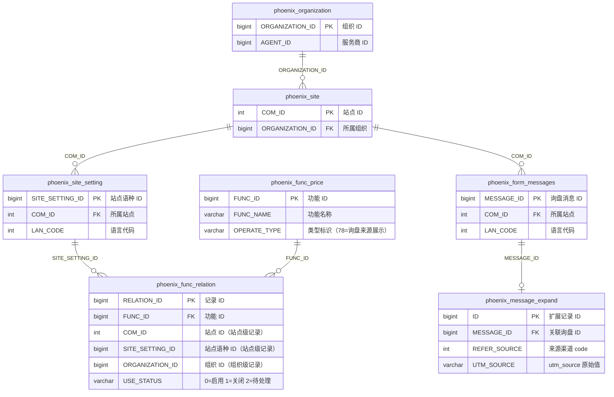

# 核心表关系 - 快速参考

## 层级关系总览

```
组织 (Organization)
 └── 站点 (Site)               ← 一个组织可以有多个站点
      └── 站点语种 (SiteSetting)  ← 一个站点可以有多个语言版本
           ├── 功能开通 (FuncRelation)   ← 每个语种独立开通功能
           └── 询盘消息 (FormMessages)   ← 每个语种独立收到询盘
                └── 询盘来源扩展 (MessageExpand) ← 每条询盘的来源分析结果
```

## 表与关联字段

| 层级 | 表名 | 主键 | 向上关联字段 | 所在数据库 |
|------|------|------|-------------|-----------|
| 组织 | `phoenix_organization` | `ORGANIZATION_ID` | — | phoenix |
| 站点 | `phoenix_site` | `COM_ID` | `ORGANIZATION_ID` → 组织 | phoenix |
| 站点语种 | `phoenix_site_setting` | `SITE_SETTING_ID` | `COM_ID` → 站点 | phoenix |
| 功能开通 | `phoenix_func_relation` | `RELATION_ID` | `SITE_SETTING_ID` → 站点语种 / `COM_ID` → 站点 | phoenix |
| 功能定义 | `phoenix_func_price` | `FUNC_ID` | — | phoenix |
| 询盘消息 | `phoenix_form_messages` | `MESSAGE_ID` | `COM_ID` → 站点 | phoenix |
| 询盘来源 | `phoenix_message_expand` | `ID` | `MESSAGE_ID` → 询盘消息 | phoenix |

## 关系图



## phoenix_func_relation 的两种记录维度

`phoenix_func_relation` 存在两种记录方式，通过字段值区分：

| 维度 | COM_ID | SITE_SETTING_ID | ORGANIZATION_ID | 说明 |
|------|--------|-----------------|-----------------|------|
| **站点级** | > 0 | > 0 | -1 | 绑定到具体站点语种，如"询盘来源展示" |
| **组织级** | -1 | -1 | > 0 | 绑定到整个组织，如某些跨站功能 |

## 常用查询速查

### 1. 从组织查站点

```sql
SELECT COM_ID, ORGANIZATION_ID
FROM phoenix_site
WHERE ORGANIZATION_ID = {organizationId};
```

### 2. 从站点查语种

```sql
SELECT SITE_SETTING_ID, COM_ID, LAN_CODE
FROM phoenix_site_setting
WHERE COM_ID = {comId};
```

### 3. 通过域名查站点

```sql
SELECT d.DOMAIN_RECORD, d.COM_ID, d.LAN_CODE, d.SITE_SETTING_ID,
       s.ORGANIZATION_ID
FROM phoenix_site_domain d
JOIN phoenix_site s ON d.COM_ID = s.COM_ID
WHERE d.DOMAIN_RECORD LIKE '%{域名关键词}%';
-- 示例：WHERE d.DOMAIN_RECORD LIKE '%test3.imwork.net%'
```

### 4. 查某站点开通的功能

```sql
SELECT fr.RELATION_ID, fr.FUNC_ID, fr.USE_STATUS,
       fr.SITE_SETTING_ID, fp.FUNC_NAME, fp.OPERATE_TYPE
FROM phoenix_func_relation fr
JOIN phoenix_func_price fp ON fr.FUNC_ID = fp.FUNC_ID
WHERE fr.COM_ID = {comId};
```

### 5. 查某站点的询盘消息

```sql
SELECT MESSAGE_ID, COM_ID, LAN_CODE, ADD_TIME
FROM phoenix_form_messages
WHERE COM_ID = {comId}
ORDER BY ADD_TIME DESC
LIMIT 50;
```

### 6. 查询盘消息的来源分析结果

```sql
SELECT m.MESSAGE_ID, m.ADD_TIME,
       e.REFER_SOURCE, e.REFER_PLATFORM, e.UTM_SOURCE
FROM phoenix_form_messages m
LEFT JOIN phoenix_message_expand e ON m.MESSAGE_ID = e.MESSAGE_ID
WHERE m.COM_ID = {comId}
ORDER BY m.ADD_TIME DESC
LIMIT 50;
```

### 7. 从组织一路查到询盘

```sql
SELECT s.COM_ID, ss.SITE_SETTING_ID, ss.LAN_CODE,
       m.MESSAGE_ID, m.ADD_TIME,
       e.REFER_SOURCE, e.UTM_SOURCE
FROM phoenix_site s
JOIN phoenix_site_setting ss ON s.COM_ID = ss.COM_ID
JOIN phoenix_form_messages m ON s.COM_ID = m.COM_ID
LEFT JOIN phoenix_message_expand e ON m.MESSAGE_ID = e.MESSAGE_ID
WHERE s.ORGANIZATION_ID = {organizationId}
ORDER BY m.ADD_TIME DESC
LIMIT 50;
```

### 8. 查某组织下"询盘来源展示"功能的状态

```sql
SELECT fr.RELATION_ID, fr.COM_ID, fr.FUNC_ID, fr.USE_STATUS,
       fr.SITE_SETTING_ID, fp.FUNC_NAME
FROM phoenix_func_relation fr
JOIN phoenix_func_price fp ON fr.FUNC_ID = fp.FUNC_ID
WHERE fp.OPERATE_TYPE = '78'
AND fr.COM_ID IN (
    SELECT COM_ID FROM phoenix_site WHERE ORGANIZATION_ID = {organizationId}
);
```

## 从组织逐级向下查询

一个组织下可能有很多站点，每个站点又有多个语种。以下演示如何从组织 ID 一路查到具体语种的功能权限或询盘消息。

### 第一步：组织 → 所有站点

```sql
SELECT COM_ID, SITE_NAME, DEFAULT_LAN_CODE
FROM phoenix_site
WHERE ORGANIZATION_ID = {organizationId};
```

> 示例：ORGANIZATION_ID=521424 → 可能查出 COM_ID=308136, 309001, 310050 等多个站点

### 第二步：站点 → 所有语种

```sql
SELECT SITE_SETTING_ID, COM_ID, LAN_CODE
FROM phoenix_site_setting
WHERE COM_ID IN (
    SELECT COM_ID FROM phoenix_site WHERE ORGANIZATION_ID = {organizationId}
);
```

> 示例：COM_ID=308136 → SITE_SETTING_ID=876525 (LAN_CODE=0, 英文)
> 如果有多语种，会出现多条记录，如 LAN_CODE=0(英文), 1(中文), 3(日文) 等

### 第三步：查指定语种的功能权限

`LAN_CODE` 常见值：0=英文, 1=中文, 3=日文, 4=韩文, 5=法文, 6=德文, 7=西班牙文 ...

查某个站点**英文站**开通了哪些功能：

```sql
SELECT ss.SITE_SETTING_ID, ss.LAN_CODE,
       fr.FUNC_ID, fp.FUNC_NAME, fr.USE_STATUS, fr.EXPIRE_TIME
FROM phoenix_site_setting ss
JOIN phoenix_func_relation fr ON fr.SITE_SETTING_ID = ss.SITE_SETTING_ID
JOIN phoenix_func_price fp ON fr.FUNC_ID = fp.FUNC_ID
WHERE ss.COM_ID = {comId}
AND ss.LAN_CODE = 0;          -- 0=英文，换成 1 就是中文站
```

查某个站点**中文站**的"询盘来源展示"功能状态：

```sql
SELECT ss.SITE_SETTING_ID, ss.LAN_CODE,
       fr.FUNC_ID, fp.FUNC_NAME, fr.USE_STATUS
FROM phoenix_site_setting ss
JOIN phoenix_func_relation fr ON fr.SITE_SETTING_ID = ss.SITE_SETTING_ID
JOIN phoenix_func_price fp ON fr.FUNC_ID = fp.FUNC_ID
WHERE ss.COM_ID = {comId}
AND ss.LAN_CODE = 1            -- 1=中文
AND fp.OPERATE_TYPE = '78';
```

从组织出发，查**所有站点、所有语种**的功能开通情况：

```sql
SELECT s.COM_ID, ss.SITE_SETTING_ID, ss.LAN_CODE,
       fr.FUNC_ID, fp.FUNC_NAME, fr.USE_STATUS
FROM phoenix_site s
JOIN phoenix_site_setting ss ON s.COM_ID = ss.COM_ID
JOIN phoenix_func_relation fr ON fr.SITE_SETTING_ID = ss.SITE_SETTING_ID
JOIN phoenix_func_price fp ON fr.FUNC_ID = fp.FUNC_ID
WHERE s.ORGANIZATION_ID = {organizationId}
ORDER BY s.COM_ID, ss.LAN_CODE, fr.FUNC_ID;
```

### 第四步：查指定语种的询盘消息

查某个站点**英文站**的询盘消息及来源：

```sql
SELECT m.MESSAGE_ID, m.COM_ID, m.LAN_CODE, m.ADD_TIME,
       e.REFER_SOURCE, e.REFER_PLATFORM, e.UTM_SOURCE
FROM phoenix_form_messages m
LEFT JOIN phoenix_message_expand e ON m.MESSAGE_ID = e.MESSAGE_ID
WHERE m.COM_ID = {comId}
AND m.LAN_CODE = 0             -- 0=英文，换成 1 就是中文站
ORDER BY m.ADD_TIME DESC
LIMIT 50;
```

查某个站点**中文站**的询盘消息及来源：

```sql
SELECT m.MESSAGE_ID, m.COM_ID, m.LAN_CODE, m.ADD_TIME,
       e.REFER_SOURCE, e.REFER_PLATFORM, e.UTM_SOURCE
FROM phoenix_form_messages m
LEFT JOIN phoenix_message_expand e ON m.MESSAGE_ID = e.MESSAGE_ID
WHERE m.COM_ID = {comId}
AND m.LAN_CODE = 1             -- 1=中文
ORDER BY m.ADD_TIME DESC
LIMIT 50;
```

从组织出发，查**所有站点、所有语种**的询盘消息：

```sql
SELECT s.COM_ID, m.MESSAGE_ID, m.LAN_CODE, m.ADD_TIME,
       e.REFER_SOURCE, e.UTM_SOURCE
FROM phoenix_site s
JOIN phoenix_form_messages m ON s.COM_ID = m.COM_ID
LEFT JOIN phoenix_message_expand e ON m.MESSAGE_ID = e.MESSAGE_ID
WHERE s.ORGANIZATION_ID = {organizationId}
ORDER BY s.COM_ID, m.LAN_CODE, m.ADD_TIME DESC
LIMIT 100;
```

### 第五步：汇总视图（一条 SQL 查全貌）

一次性查出某个组织下：每个站点、每个语种的"询盘来源展示"功能状态 + 该语种的询盘总数：

```sql
SELECT s.COM_ID,
       ss.SITE_SETTING_ID,
       ss.LAN_CODE,
       fr.USE_STATUS AS refer_source_status,
       (SELECT COUNT(1) FROM phoenix_form_messages m
        WHERE m.COM_ID = s.COM_ID AND m.LAN_CODE = ss.LAN_CODE) AS inquiry_count
FROM phoenix_site s
JOIN phoenix_site_setting ss ON s.COM_ID = ss.COM_ID
LEFT JOIN phoenix_func_relation fr
    ON fr.SITE_SETTING_ID = ss.SITE_SETTING_ID
    AND fr.FUNC_ID = (SELECT FUNC_ID FROM phoenix_func_price WHERE OPERATE_TYPE = '78' LIMIT 1)
WHERE s.ORGANIZATION_ID = {organizationId}
ORDER BY s.COM_ID, ss.LAN_CODE;
```

> 结果示例：COM_ID=308136, LAN_CODE=0(英文), refer_source_status=0(已启用), inquiry_count=120

## 实际数据示例（demo-leadong@1208）

```
phoenix_organization (ORGANIZATION_ID = 521424)
    │
    │ ORGANIZATION_ID
    ▼
phoenix_site (COM_ID = 308136)
    │
    │ COM_ID
    ▼
phoenix_site_setting (SITE_SETTING_ID = 876525, LAN_CODE = 0)
    │
    │ SITE_SETTING_ID / COM_ID
    ├────────────────────────────────────┐
    ▼                                    ▼
phoenix_func_relation                 phoenix_form_messages
(FUNC_ID=2064, USE_STATUS=0)          (该站点的询盘消息)
(询盘来源展示 - 已启用)                     │
                                         │ MESSAGE_ID
                                         ▼
                                    phoenix_message_expand
                                    (REFER_SOURCE, UTM_SOURCE)
```
