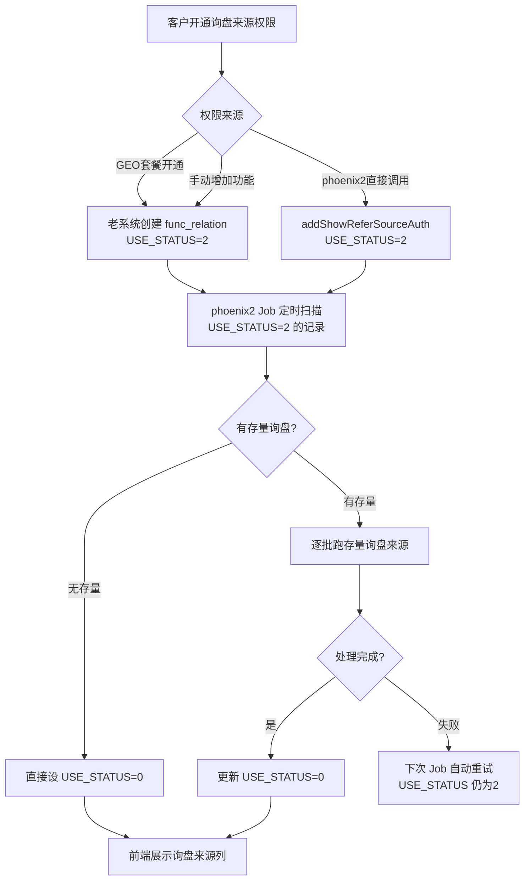

# 询盘来源展示 - Job 轮询方案（最终版）

## 核心思路

老系统开通权限时直接设 `USE_STATUS=2`（待处理），不通知 phoenix2。phoenix2 的 `FormMessageReportJob` 定时扫描 `USE_STATUS=2` 的记录，跑存量数据后改为 `USE_STATUS=0`（已激活）。

## USE_STATUS 状态定义

- `0` = 已激活（前端展示"询盘来源"列）
- `1` = 已停用（现有语义，保持不变）
- `2` = 待处理（新增，等待 Job 跑存量数据）

## 完整流程



## 改动清单

### 1. 老系统（phoenix）

**文件：订单处理流程**（创建 func_relation 的地方）
- 当 `OPERATE_TYPE='78'` 时，`USE_STATUS` 设为 `'2'` 而非默认的 `'0'`

**文件：[PhoenixInquiryNewController.java](e:\lea_project\phoenix\TtnSmartBw\src\main\java\com\focustech\subsys\smart\web\controller\phoenix\PhoenixInquiryNewController.java) line 287-291**
- 不使用通用 `hasFunction`（不检查 USE_STATUS），改为专用方法
- 新增 `hasShowReferSourceAuth(comId)` 方法：查 `phoenix_func_relation` + `phoenix_func_price`，条件包含 `USE_STATUS='0'` 且 `OPERATE_TYPE='78'`

**文件：[phoenix_func_relation_SqlMap.xml](e:\lea_project\phoenix\TtnSmartCore\src\main\resources\config\ibatis_sql_map\phoenix\phoenix_func_relation_SqlMap.xml)**
- 新增 SQL：`selectActiveRelationByComIdAndOperateType`，在现有 `selectRelationByComIdAndOperateType` 基础上加 `AND a.USE_STATUS='0'`

### 2. phoenix2（编辑器项目）

**文件：[PhoenixFormMessageServiceImpl.java](e:\lea_project\independentProject\编辑器\phoenix2.0\phoenix2-module-core\phoenix2-form\phoenix2-form-biz\src\main\java\com\focustech\leadong\form\service\imp\PhoenixFormMessageServiceImpl.java) line 199-202**
- `hasShowReferSourceAuth` 判断增加 `USE_STATUS='0'` 条件

**文件：[PhoenixFuncRelationDubboServiceImpl.java](e:\lea_project\independentProject\编辑器\phoenix2.0\phoenix2-module-core\phoenix2-site\phoenix2-site-biz\src\main\java\com\focustech\leadong\site\service\dubbo\PhoenixFuncRelationDubboServiceImpl.java) line 122-148**
- `addShowReferSourceAuth` 中 `USE_STATUS` 从 `"1"` 改为 `"2"`

**文件：[FormMessageReportJob.java](e:\lea_project\independentProject\编辑器\phoenix2.0\phoenix2-job\phoenix2-job-form\src\main\java\com\focustech\leadong\form\job\FormMessageReportJob.java)**
- 新增定时方法 `processReferSourcePendingData()`，仅 beta 环境运行
- 逻辑：
  1. 查询所有 `OPERATE_TYPE='78'` 且 `USE_STATUS='2'` 的 `func_relation` 记录
  2. 对每条记录的 comId，用 `LIMIT 1` 快速判断是否有存量询盘
  3. 无存量 → 直接改 `USE_STATUS='0'`
  4. 有存量 → 复用 `initMessageReferSource` 核心逻辑逐批处理
  5. 处理完成 → 改 `USE_STATUS='0'`
  6. 处理失败 → 保持 `USE_STATUS='2'`，下次 Job 自动重试

**文件：[PhoenixFormMessageController.java](e:\lea_project\independentProject\编辑器\phoenix2.0\phoenix2-module-core\phoenix2-form\phoenix2-form-biz\src\main\java\com\focustech\leadong\form\controller\PhoenixFormMessageController.java) line 338-398**
- 保留 `initMessageReferSource` 作为手动补偿接口
- 去掉 beta 限制（或保留，由后续需求决定）

### 3. 部署前 SQL

```sql
-- 将现有 USE_STATUS=1 的询盘来源权限记录改为 USE_STATUS=0（已激活）
-- 这些是 addShowReferSourceAuth 之前创建的记录，客户已在使用
UPDATE phoenix_func_relation a
JOIN phoenix_func_price b ON a.FUNC_ID = b.FUNC_ID
SET a.USE_STATUS = '0'
WHERE b.OPERATE_TYPE = '78'
  AND a.USE_STATUS = '1';
```

## 方案优势

- **无跨系统调用**：老系统只改数据库状态，不需要调 phoenix2 接口
- **天然可重试**：Job 失败后 USE_STATUS 仍为 2，下次自动重试
- **向后兼容**：用新状态值 2，不影响现有 0/1 语义
- **复用现有代码**：Job 基础设施和 initMessageReferSource 处理逻辑都已存在
- **可观测**：`SELECT COUNT(*) FROM phoenix_func_relation WHERE USE_STATUS='2'` 即可查看待处理队列
