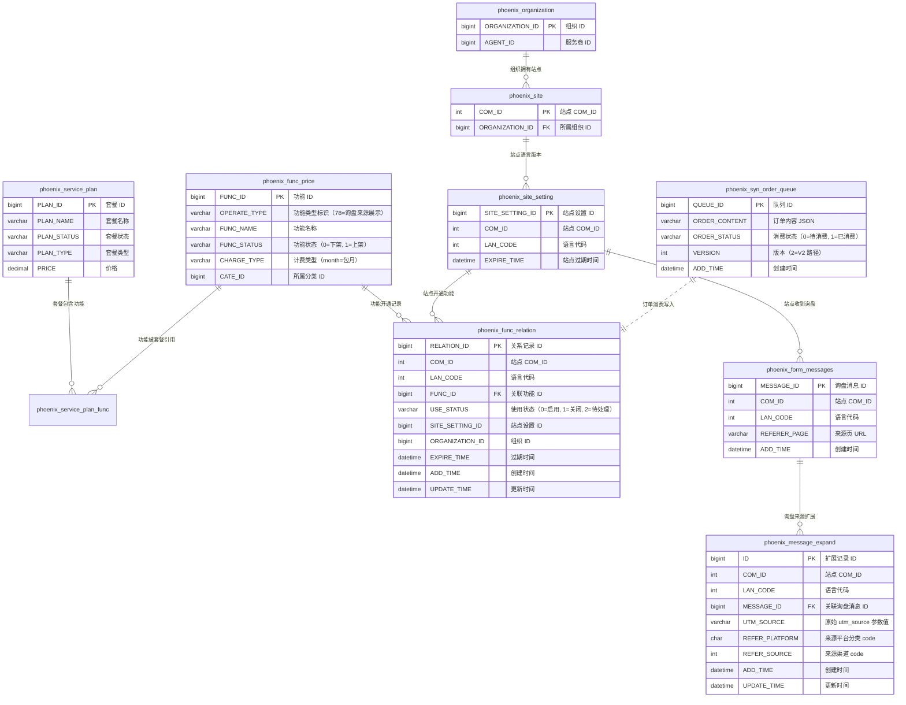
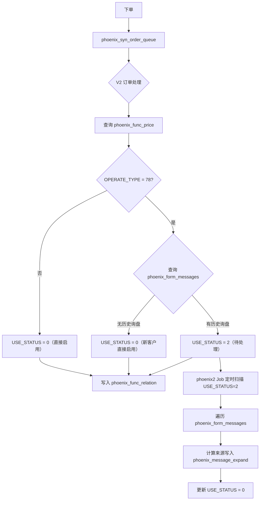

# 询盘来源展示 - 数据库表关系说明

## 表关系图

## 数据流转图

---

## 各表详细说明

### 1. phoenix_func_price（功能定价表）

**用途**：定义系统中所有可售功能的基本信息和定价。

| 字段 | 类型 | 说明 |
|------|------|------|
| FUNC_ID | bigint | 功能 ID（主键） |
| FUNC_NAME | varchar | 功能名称 |
| OPERATE_TYPE | varchar | 功能类型标识，**`78` = 询盘来源展示** |
| FUNC_STATUS | char | 功能状态：`0`=下架, `1`=上架 |
| CHARGE_TYPE | varchar | 计费类型：`month`=包月 |
| CATE_ID | bigint | 所属分类 ID |

**本次需求作用**：通过 `OPERATE_TYPE='78'` 识别"询盘来源展示"功能，决定下单时的 `USE_STATUS` 初始值。

---

### 2. phoenix_func_relation（功能开通关系表）

**用途**：记录每个站点/组织开通了哪些功能，以及功能的当前状态。

| 字段 | 类型 | 说明 |
|------|------|------|
| RELATION_ID | bigint | 关系记录 ID（主键） |
| COM_ID | int | 站点 COM_ID（`-1` 表示组织级功能） |
| LAN_CODE | int | 语言代码（`-1` 表示组织级） |
| FUNC_ID | bigint | 关联的功能 ID（外键 → phoenix_func_price） |
| **USE_STATUS** | char | **使用状态（核心字段）** |
| SITE_SETTING_ID | bigint | 站点设置 ID（`-1` 表示组织级） |
| ORGANIZATION_ID | bigint | 组织 ID |
| EXPIRE_TIME | datetime | 过期时间 |
| ADD_TIME | datetime | 创建时间 |
| UPDATE_TIME | datetime | 更新时间 |

**USE_STATUS 取值**：

| 值 | 含义 | 说明 |
|----|------|------|
| `0` | 启用 | 功能已激活，前端展示询盘来源列 |
| `1` | 关闭 | 功能未开通或已关闭 |
| `2` | 待处理（本次新增） | 有历史询盘需要刷数据，phoenix2 Job 处理完后改为 `0` |

**本次需求作用**：新增 `USE_STATUS=2` 状态，下单时根据是否有历史询盘决定初始状态；前端查询时 `USE_STATUS IN (0, 2)` 都视为已开通。

---

### 3. phoenix_form_messages（询盘消息表）

**用途**：存储客户网站收到的所有询盘消息原始记录。

| 字段 | 类型 | 说明 |
|------|------|------|
| MESSAGE_ID | bigint | 询盘消息 ID（主键） |
| COM_ID | int | 站点 COM_ID |
| LAN_CODE | int | 语言代码 |
| REFERER_PAGE | varchar | 来源页 URL |
| ADD_TIME | datetime | 询盘创建时间 |

**本次需求作用**：
- 判断新客户：若 `COM_ID` 下无记录 → 新客户，直接 `USE_STATUS=0`
- phoenix2 Job 遍历该表为每条询盘计算来源

---

### 4. phoenix_message_expand（消息来源扩展表）

**用途**：存储每条询盘消息的来源归因结果，是"询盘来源展示"功能的核心数据表。

| 字段 | 类型 | 说明 |
|------|------|------|
| ID | bigint | 扩展记录 ID（主键） |
| COM_ID | int | 站点 COM_ID |
| LAN_CODE | int | 语言代码 |
| MESSAGE_ID | bigint | 关联询盘消息 ID（外键 → phoenix_form_messages） |
| **UTM_SOURCE** | varchar(500) | 原始 utm_source 参数值（如 `google`、`chatgpt.com`） |
| **REFER_PLATFORM** | char | 来源平台分类 code |
| **REFER_SOURCE** | int | 来源渠道 code |
| ADD_TIME | datetime | 创建时间 |
| UPDATE_TIME | datetime | 更新时间 |

**REFER_PLATFORM 取值**（对应 `ReferPlatForm` 枚举）：

| code | 含义 |
|------|------|
| `0` | AI 对话平台 |
| `1` | 搜索引擎 |
| `2` | 社交媒体 |
| `3` | 直接访问 |
| `4` | 其他 |

**REFER_SOURCE 取值**（对应 `ReferSourceEnums` 枚举）：

| code | 名称 | 平台分类 |
|------|------|---------|
| 0 | ChatGPT | AI |
| 1 | Gemini | AI |
| 2 | Claude | AI |
| 3 | Copilot | AI |
| 4 | Perplexity | AI |
| 5 | xAI Grok | AI |
| 6 | DeepSeek | AI |
| 7 | POE | AI |
| 8 | Kimi | AI |
| 10 | Google | 搜索引擎 |
| 11 | Bing | 搜索引擎 |
| 12 | Yandex | 搜索引擎 |
| 13 | Facebook | 社交媒体 |
| 14 | X（Twitter） | 社交媒体 |
| 15 | Linkedin | 社交媒体 |
| 16 | Tiktok | 社交媒体 |
| 17 | Instagram | 社交媒体 |
| 18 | 直接访问 | 直接访问 |
| 19 | 其他 | 其他 |

**前端展示逻辑**：后端返回 `REFER_SOURCE` 的整数 code，前端/JSP 根据 code 匹配图标和名称。**展示名称不存储在数据库中**，由代码枚举或 JSP 硬编码决定。

---

### 5. phoenix_service_plan（服务套餐表）

**用途**：定义可售的服务套餐，每个套餐包含多个功能。

| 字段 | 类型 | 说明 |
|------|------|------|
| PLAN_ID | bigint | 套餐 ID（主键） |
| PLAN_NAME | varchar | 套餐名称 |
| PLAN_STATUS | char | 套餐状态 |
| PLAN_TYPE | char | 套餐类型 |
| PRICE | decimal | 价格 |

**本次需求作用**：GEO 套餐中集成了"询盘来源展示"功能（FUNC_ID 对应 OPERATE_TYPE=78），购买 GEO 套餐时自动开通该功能。

---

### 6. phoenix_syn_order_queue（订单同步队列表）

**用途**：订单下单后写入队列，由定时任务消费处理。

| 字段 | 类型 | 说明 |
|------|------|------|
| QUEUE_ID | bigint | 队列 ID（主键） |
| ORDER_CONTENT | text | 订单内容（JSON 格式，包含功能列表等） |
| ORDER_STATUS | char | 消费状态：`0`=待消费, `1`=已消费 |
| VERSION | int | 处理版本：`2`=V2 路径（当前使用） |
| ADD_TIME | datetime | 创建时间 |

**本次需求作用**：订单消费时，V2 路径调用 `resolveInitUseStatus(funcId, comId)` 判断初始 `USE_STATUS`。

---

### 7. phoenix_site_setting（站点设置表）

**用途**：每个站点的每个语言版本对应一条记录。

| 字段 | 类型 | 说明 |
|------|------|------|
| SITE_SETTING_ID | bigint | 站点设置 ID（主键） |
| COM_ID | int | 站点 COM_ID |
| LAN_CODE | int | 语言代码 |
| EXPIRE_TIME | datetime | 站点过期时间 |

**本次需求作用**：V2 订单处理中，`siteSetting.getComId()` 作为参数传入 `resolveInitUseStatus`，用于判断该站点是否有历史询盘。

---

### 8. phoenix_organization / phoenix_site（组织与站点表）

**用途**：组织与站点的归属关系。

| 表 | 关键字段 | 说明 |
|---|---------|------|
| phoenix_organization | ORGANIZATION_ID, AGENT_ID | 组织（客户）基本信息 |
| phoenix_site | COM_ID, ORGANIZATION_ID | 站点与组织的关联（一个组织可有多个站点） |

**本次需求作用**：通过 `ORGANIZATION_ID` 关联到具体站点的 `COM_ID`，用于定位客户的询盘数据。

---

## 核心业务规则总结

1. **下单开通**：购买包含 `OPERATE_TYPE=78` 功能的订单 → 写入 `phoenix_func_relation`
2. **状态判断**：`resolveInitUseStatus(funcId, comId)`
   - 非"询盘来源展示"功能 → `USE_STATUS=0`
   - "询盘来源展示" + 新客户（无历史询盘）→ `USE_STATUS=0`
   - "询盘来源展示" + 老客户（有历史询盘）→ `USE_STATUS=2`
3. **异步刷数据**：phoenix2 Job 扫描 `USE_STATUS=2` 的记录，遍历 `phoenix_form_messages` 计算来源写入 `phoenix_message_expand`，完成后更新为 `USE_STATUS=0`
4. **前端展示**：查询 `phoenix_func_relation.USE_STATUS IN (0, 2)` 时展示"询盘来源"列，通过 `phoenix_message_expand.REFER_SOURCE` 的 code 值渲染图标和名称
